# AssetMonitoring — Complete Interview Guide

> A practical .NET interview guide built from the design and implementation
> decisions made while developing AssetMonitoring.

## Purpose

This is a new, standalone guide. It is not a changelog and does not assume that
the reader has seen the mentoring conversation.

Every major topic is explained through the same questions:

1. What does the concept mean?
2. Where is it used in AssetMonitoring?
3. Why is the chosen approach correct?
4. What would be a wrong implementation?
5. How can the answer be explained during an interview?

The code samples are intentionally small. They demonstrate the idea without
replacing the production implementation.

## How to use this guide

- Read the explanation first.
- Hide the answer and answer each interview question aloud.
- Compare your answer with the model answer.
- Explain the project example without reading the code.
- Revisit the incorrect examples and identify the violated rule yourself.

## Status notation

| Mark | Meaning |
| --- | --- |
| ✅ | Implemented and manually verified |
| 🚧 | Partially implemented or still being studied |
| 📋 | Designed or planned, but not implemented |

## Table of contents

### Part I — The project and implemented vertical slice

1. [Product and architecture](#1-product-and-architecture)
2. [Device domain model](#2-device-domain-model)
3. [Device catalog pipeline](#3-device-catalog-pipeline)
4. [Catalog validation](#4-catalog-validation)
5. [Catalog synchronization](#5-catalog-synchronization)
6. [EF Core and SQL Server](#6-ef-core-and-sql-server)
7. [Repository, queries, DTOs, and API](#7-repository-queries-dtos-and-api)

### Part II — Theory demonstrated by the project

8. [SOLID](#8-solid)
9. [Dependency Injection fundamentals](#9-dependency-injection-fundamentals)
10. [Dependency Injection lifetimes](#10-dependency-injection-lifetimes)
11. [`IDisposable` and `IAsyncDisposable`](#11-idisposable-and-iasyncdisposable)
12. [Async/await](#12-asyncawait)
13. [Collections, equality, and LINQ](#13-collections-equality-and-linq)
14. [Exceptions, validation, and HTTP errors](#14-exceptions-validation-and-http-errors)

### Part III — Designed next stages

15. [Telemetry model](#15-telemetry-model)
16. [Heartbeat, ordering, and idempotency](#16-heartbeat-ordering-and-idempotency)
17. [Alerts and notifications](#17-alerts-and-notifications)
18. [RabbitMQ, MediatR, and Polly](#18-rabbitmq-mediatr-and-polly)
19. [Device simulator and realtime dashboard](#19-device-simulator-and-realtime-dashboard)
20. [Testing and CI](#20-testing-and-ci)
21. [Project status and next steps](#21-project-status-and-next-steps)
22. [Rapid interview review](#22-rapid-interview-review)

### Part IV — Debugging history

23. [Implementation mistakes and lessons](#23-implementation-mistakes-and-lessons)

---

# Part I — The project and implemented vertical slice

## 1. Product and architecture

### Product goal

AssetMonitoring is an IoT backend for monitoring one warehouse. The MVP is
designed around ten simulated devices that can report:

- temperature;
- humidity;
- door state;
- light state;
- heartbeat and connectivity information.

The backend registers devices, stores telemetry, detects abnormal conditions,
creates alerts, and sends notifications to an administrator.

### What is an MVP?

MVP means **Minimum Viable Product**: the smallest usable version that proves the
main business flow and provides enough feedback for the next decision.

For AssetMonitoring, the MVP is not every possible controller, protocol, rule,
and dashboard. It is one warehouse, one Admin, ten simulated devices, four
telemetry capabilities, connectivity, alerts, notifications, and history.

### Why a modular monolith?

The initial idea demonstrated distributed-system concepts, but a single
developer does not need independent deployments on day one. The MVP therefore
uses a modular monolith.

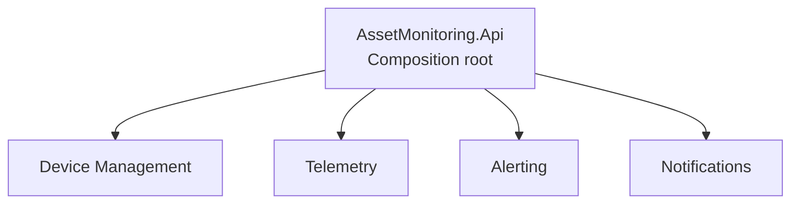

Each module owns a clear business area, but all modules are hosted by one ASP.NET
Core process. The API project is the composition root: it configures modules,
dependency injection, HTTP endpoints, and application startup.

### Why not start with microservices?

Microservices add operational costs:

- network communication;
- distributed transactions;
- independent deployment pipelines;
- message delivery guarantees;
- monitoring and tracing across processes;
- more complicated local development.

A modular monolith preserves boundaries without paying all those costs. A module
can be extracted later only if scaling, ownership, or deployment requirements
justify it.

### Current modules

| Module | Responsibility | Status |
| --- | --- | :---: |
| `AssetMonitoring.Api` | HTTP API and composition root | ✅ |
| `DeviceManagement` | Device metadata, lifecycle, catalog, SQL, queries | ✅ first slice |
| `Telemetry` | Telemetry ingestion and history | 📋 |
| `Alerting` | Rules, alerts, incidents, offline detection | 📋 |
| `Notifications` | Notification delivery and retry history | 📋 |
| `DeviceSimulator` | Ten asynchronous simulated devices | 📋 |

### Solution and project layout

```text
AssetMonitoring.slnx
└── src
    ├── AssetMonitoring.Api
    ├── AssetMonitoring.Modules.DeviceManagement
    ├── AssetMonitoring.Modules.Telemetry
    ├── AssetMonitoring.Modules.Alerting
    └── AssetMonitoring.Modules.Notifications
```

`AssetMonitoring.Api` is an ASP.NET Core Web API project. Each module is a class
library referenced by the host; a class library does not run its own HTTP server.

Folders inside one project are not separate projects. Creating a root Web project
and then placing directories named like modules inside it caused duplicate-looking
items in Solution Explorer. The corrected layout gives every module its own
`.csproj` under `src`.

Namespaces follow project and domain boundaries, not the physical solution folder
name `src`:

```csharp
namespace AssetMonitoring.Modules.DeviceManagement.Domain.Devices;
```

Including `src.AssetMonitoring...` in the namespace caused the IDE folder/namespace
warning and leaked a repository-layout detail into code identity.

### Correct architectural direction

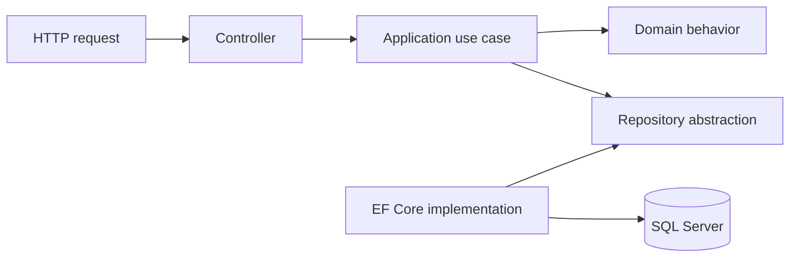

Dependencies point toward contracts and domain behavior. Infrastructure knows
how data is stored; the application use case knows what the system must do.

### Incorrect alternative

```csharp
public sealed class DeviceCatalogController : ControllerBase
{
    public IActionResult Synchronize()
    {
        using var connection = new SqlConnection("hard-coded connection");
        var json = System.IO.File.ReadAllText("hard-coded path");

        // Deserialize, validate, compare, update SQL, and build HTTP result here.
        return Ok();
    }
}
```

This controller owns file I/O, deserialization, validation, business decisions,
SQL persistence, and HTTP translation. It is difficult to test and has many
reasons to change.

### Interview questions

#### What architecture does AssetMonitoring currently use?

> AssetMonitoring uses a modular monolith. Each module owns a business capability,
> while one ASP.NET Core API hosts and composes the modules. This keeps deployment
> simple while preserving boundaries that could support later extraction.

#### What does MVP mean in this project?

> It is the smallest end-to-end warehouse-monitoring product that proves device
> registration, telemetry, connectivity, alerts, notifications, and history
> without prematurely implementing every protocol or deployment topology.

#### Why did you not begin with microservices?

> The MVP is built by one developer and has no proven independent scaling or
> deployment requirement. Microservices would add network, messaging,
> observability, and operational complexity before those costs are justified.

#### What is a composition root?

> It is the application location where the object graph is assembled. In this
> project, `AssetMonitoring.Api` loads configuration and registers module services
> in the DI container.

---

## 2. Device domain model

### Entity, not `struct`

A Device has a stable identity and changes during its lifetime. That makes it a
domain entity and therefore a reference type is appropriate.

```csharp
public sealed class Device
{
    public Guid Id { get; private set; }
    public string Code { get; private set; } = null!;
    public DeviceLifecycle Lifecycle { get; private set; }
}
```

A `struct` has value semantics and is copied by value. It is better for small,
immutable values such as coordinates or money-like value objects, not a mutable
entity tracked by EF Core.

### Identity versus metadata

| Data | Meaning | Can catalog synchronization replace it? |
| --- | --- | :---: |
| `Id` | Internal database identity | No |
| `Code` | Stable external/catalog identity | No |
| `Name` | Human-readable metadata | Yes |
| `HardwareModel` | Device metadata | Yes |
| `HardwareRevision` | Device metadata | Yes |
| `FirmwareVersion` | Device metadata | Yes |
| `Location` | Device metadata | Yes |
| `Capabilities` | Supported telemetry types | Yes |
| `Lifecycle` | Business lifecycle | Only through domain methods |

`Code` is the synchronization key. `Id` remains the internal SQL identity.

### Encapsulation

#### Incorrect

```csharp
public class Device
{
    public Guid Id { get; set; }
    public DeviceLifecycle Lifecycle { get; set; }
    public DateTime? RetiredAtUtc { get; set; }
}
```

Any caller can create impossible states:

```csharp
device.Lifecycle = DeviceLifecycle.Registered;
device.RetiredAtUtc = DateTime.UtcNow;
```

The Device is now registered and retired at the same time.

#### Correct direction

```csharp
public DeviceLifecycle Lifecycle { get; private set; }
public DateTime? RetiredAtUtc { get; private set; }

public bool Retire(DateTime retiredAtUtc)
{
    if (retiredAtUtc.Kind != DateTimeKind.Utc)
    {
        throw new ArgumentException(
            "Retirement time must be UTC.",
            nameof(retiredAtUtc));
    }

    if (Lifecycle == DeviceLifecycle.Retired)
    {
        return false;
    }

    Lifecycle = DeviceLifecycle.Retired;
    RetiredAtUtc = retiredAtUtc;
    return true;
}
```

Only the entity can change its lifecycle, so it can preserve its invariants.

### Why return `bool` from idempotent state changes?

`Retire` and `Restore` are commands, but the caller also needs to know whether
the command changed state.

```csharp
if (existingDevice.Restore())
{
    restored++;
    hasChanges = true;
}
```

Returning `false` for an already-completed transition makes the operation
idempotent and supports accurate synchronization counters.

### Device lifecycle

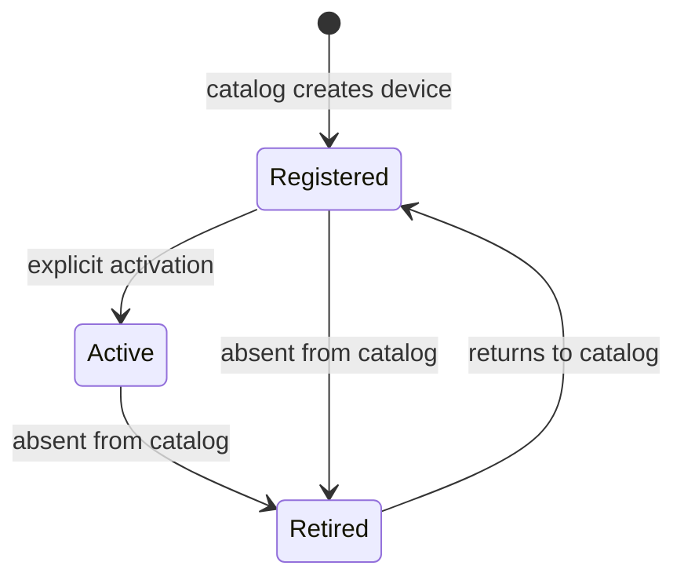

Lifecycle is not the same as connection status:

| Concept | Examples | Source |
| --- | --- | --- |
| Business lifecycle | Registered, Active, Retired | Admin/catalog/domain commands |
| Connectivity | Online, Offline, NeverConnected | Heartbeat timestamps |

Putting `Online` and `Offline` inside `DeviceLifecycle` would mix two independent
state machines.

### Capabilities are a set

A device can support several telemetry types:

```csharp
public enum DeviceCapability
{
    Temperature,
    Humidity,
    DoorState,
    LightState
}
```

#### Incorrect

```csharp
public DeviceCapability Capability { get; private set; }
```

This property can represent only one capability.

#### Correct domain idea

```csharp
private readonly HashSet<DeviceCapability> _capabilities = [];

public IReadOnlySet<DeviceCapability> Capabilities => _capabilities;
```

`HashSet<T>` expresses uniqueness. `IReadOnlySet<T>` prevents callers from
modifying the collection directly.

### Why not expose `HashSet<T>` directly?

```csharp
// Wrong: caller can bypass domain behavior.
public HashSet<DeviceCapability> Capabilities { get; set; } = [];
```

A caller could clear or replace the collection without validation. Exposing a
read-only abstraction preserves encapsulation.

### Required values and nullable values

`RetiredAtUtc` must be nullable because a new or active device has never been
retired:

```csharp
public DateTime? RetiredAtUtc { get; private set; }
```

`RegisteredAtUtc` is required and therefore remains non-nullable:

```csharp
public DateTime RegisteredAtUtc { get; private set; }
```

### UTC invariant

The entity requires UTC instead of silently converting an ambiguous value:

```csharp
if (registeredAtUtc.Kind != DateTimeKind.Utc)
{
    throw new ArgumentException(
        "Registration time must be UTC.",
        nameof(registeredAtUtc));
}
```

This makes a violated contract visible at the boundary. A future API DTO may
parse or normalize input before constructing the entity, but the entity itself
should not accept ambiguous time.

### Metadata updates

The update operation validates once, compares values, and changes only when
needed:

```csharp
public bool UpdateMetadata(
    string name,
    string hardwareModel,
    string hardwareRevision,
    string firmwareVersion,
    string location,
    IEnumerable<DeviceCapability> capabilities)
{
    // Validate required input first.

    var currentMetadata =
        (Name, HardwareModel, HardwareRevision, FirmwareVersion, Location);

    var incomingMetadata =
        (name, hardwareModel, hardwareRevision, firmwareVersion, location);

    var newCapabilities = capabilities.ToHashSet();

    if (currentMetadata == incomingMetadata &&
        _capabilities.SetEquals(newCapabilities))
    {
        return false;
    }

    ApplyMetadata(
        name,
        hardwareModel,
        hardwareRevision,
        firmwareVersion,
        location,
        newCapabilities);

    return true;
}
```

The tuple is appropriate for equality comparison of several scalar values. It is
not used as a reflection-based mechanism to discover and mutate properties.

#### Incorrect generic-list update idea

```csharp
var oldValues = new[] { Name, HardwareModel, FirmwareVersion };
var newValues = new[] { name, hardwareModel, firmwareVersion };

// LINQ can compare values, but it cannot know which domain property to assign.
```

Properties have meaning and invariants. Hiding their assignment in a generic
loop makes the code less explicit and provides no real benefit.

### Private EF Core constructor

EF Core needs a way to materialize an entity from the database without calling
the public creation workflow.

```csharp
private Device()
{
}
```

The private constructor belongs inside the `Device` class. It exists for the ORM;
application code continues to use the validated public constructor.

### Interview questions

#### Why is Device a class instead of a struct?

> Device is an entity with stable identity and mutable lifecycle. A class gives
> reference semantics and works naturally with EF Core tracking. A struct is more
> appropriate for a small immutable value.

#### Why are setters private?

> Private setters force state changes through domain methods such as `Retire`,
> `Restore`, and `UpdateMetadata`, allowing the entity to protect its invariants.

#### Why use `HashSet` for capabilities?

> Capabilities must be unique and order has no business meaning. `HashSet` models
> that rule directly and provides `SetEquals` for comparison.

#### Why is `RetiredAtUtc` nullable?

> A device that has never been retired has no retirement timestamp. `null`
> represents that valid absence explicitly.

#### Is lifecycle the same as online/offline status?

> No. Lifecycle is a business state controlled by registration, activation, and
> retirement. Connectivity is derived from heartbeat activity and changes much
> more frequently.

---

## 3. Device catalog pipeline

### End-to-end flow

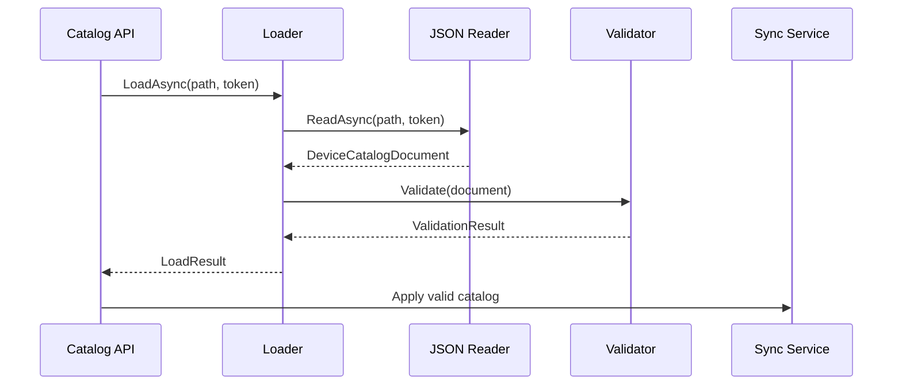

The pipeline separates technical reading, business validation, and database
synchronization.

### Catalog contracts

```csharp
public sealed class DeviceCatalogDocument
{
    public required List<DeviceCatalogItem> Devices { get; init; }
}

public sealed class DeviceCatalogItem
{
    public required string Code { get; init; }
    public required string Name { get; init; }
    public required string HardwareModel { get; init; }
    public required string HardwareRevision { get; init; }
    public required string FirmwareVersion { get; init; }
    public required string Location { get; init; }
    public required List<DeviceCapability> Capabilities { get; init; }
}
```

These classes represent an input document. They are not domain entities and do
not need domain behavior.

### Why `required` and `init`?

- `required` tells C# callers that a member must be supplied during creation.
- `init` allows assignment only during initialization.
- JSON input must still be validated because external documents can omit, null,
  or provide invalid data regardless of compile-time C# checks.

### Why a `List` in the JSON contract?

JSON arrays are ordered sequences and may contain duplicates. The contract should
faithfully capture the input so the validator can report duplicate capabilities.

If deserialization immediately converted the array to a `HashSet`, duplicate
input would disappear before validation could detect it.

### Reader abstraction

```csharp
public interface IDeviceCatalogReader
{
    Task<DeviceCatalogDocument> ReadAsync(
        string path,
        CancellationToken cancellationToken = default);
}
```

The interface describes the operation, not a specific format. A future XML
implementation can use the same contract.

### JSON reader

```csharp
public sealed class JsonDeviceCatalogReader : IDeviceCatalogReader
{
    private static readonly JsonSerializerOptions SerializerOptions = new()
    {
        PropertyNameCaseInsensitive = true,
        Converters = { new JsonStringEnumConverter() }
    };

    public async Task<DeviceCatalogDocument> ReadAsync(
        string path,
        CancellationToken cancellationToken = default)
    {
        ArgumentException.ThrowIfNullOrWhiteSpace(path);

        await using var stream = File.OpenRead(path);

        var document =
            await JsonSerializer.DeserializeAsync<DeviceCatalogDocument>(
                stream,
                SerializerOptions,
                cancellationToken);

        return document
            ?? throw new JsonException(
                "Device catalog JSON produced a null document.");
    }
}
```

### Serialization terminology

```text
C# object → JSON = serialization
JSON → C# object = deserialization
```

The reader performs deserialization because it reads JSON and creates C# objects.

### Does reading and deserializing violate SRP?

No. Opening the JSON file, configuring JSON parsing, and deserializing it are all
parts of one responsibility: loading a JSON catalog.

Validation and SQL synchronization are separate reasons to change and therefore
belong to separate components.

### Incorrect reader

```csharp
public async Task<DeviceCatalogDocument> ReadAsync(string path)
{
    var document = await DeserializeAsync(path);

    ValidateExactlyTenDevices(document);
    await SaveToSqlAsync(document);

    return document;
}
```

The class now changes when JSON parsing changes, business validation changes, or
SQL persistence changes.

### Loader orchestration

```csharp
public sealed record DeviceCatalogLoadResult(
    DeviceCatalogDocument Document,
    DeviceCatalogValidationResult ValidationResult)
{
    public bool IsValid => ValidationResult.IsValid;
}
```

```csharp
public sealed class DeviceCatalogLoader
{
    private readonly DeviceCatalogValidator _validator;
    private readonly IDeviceCatalogReader _reader;

    public async Task<DeviceCatalogLoadResult> LoadAsync(
        string path,
        CancellationToken cancellationToken = default)
    {
        var document = await _reader.ReadAsync(path, cancellationToken);
        var validation = _validator.Validate(document);

        return new DeviceCatalogLoadResult(document, validation);
    }
}
```

The loader coordinates two components. Coordination is its single responsibility.

### Path construction

#### Incorrect

```csharp
var path =
    "D:\\Games\\Codding\\AssetMonitoring\\src\\AssetMonitoring.Api\\...";
```

This works only on one machine.

#### Correct

```csharp
var path = Path.Combine(
    environment.ContentRootPath,
    "Configuration",
    "DeviceCatalog",
    "device-catalog.json");
```

The API host supplies its content root, and `Path.Combine` uses the platform's
path separator.

### Interview questions

#### Why are catalog DTOs different from the Device entity?

> Catalog DTOs model untrusted external input and support deserialization. The
> Device entity models validated business state and protects invariants. Keeping
> them separate prevents external data from directly mutating the domain.

#### Does `required` replace runtime validation?

> No. It helps C# callers at compile time, but JSON is external input and can still
> contain missing, null, empty, duplicated, or otherwise invalid values.

#### Why should capabilities remain a List in the input DTO?

> It preserves the original JSON, including duplicates, so validation can report
> bad input instead of silently normalizing it.

#### What is the responsibility of `DeviceCatalogLoader`?

> It orchestrates catalog reading and validation and returns both the document and
> structured validation result. It does not apply database changes itself.

---

## 4. Catalog validation

### Result model

```csharp
public sealed record DeviceCatalogValidationError(
    string ErrorCode,
    string Message,
    string? DeviceCode = null,
    string? PropertyName = null);
```

```csharp
public sealed class DeviceCatalogValidationResult
{
    private readonly List<DeviceCatalogValidationError> _errors;

    public bool IsValid => _errors.Count == 0;
    public IReadOnlyList<DeviceCatalogValidationError> Errors => _errors;

    public DeviceCatalogValidationResult(
        IEnumerable<DeviceCatalogValidationError> errors)
    {
        ArgumentNullException.ThrowIfNull(errors);
        _errors = errors.ToList();
    }
}
```

### Why collect errors instead of throwing for the first rule violation?

A malformed file or inaccessible path is a technical failure. A catalog with an
empty name or duplicate code is readable but fails business validation.

| Situation | Handling |
| --- | --- |
| File does not exist | Technical exception |
| JSON syntax is malformed | `JsonException` |
| Catalog contains 9 devices | Validation error |
| Required name is empty | Validation error |
| Device code is duplicated | Validation error |

Collecting business errors allows the Admin to fix all detected problems in one
attempt.

### Exactly ten devices

```csharp
if (document.Devices.Count != 10)
{
    errors.Add(new DeviceCatalogValidationError(
        ErrorCode: "CatalogDeviceCount",
        Message: $"Catalog must contain exactly 10 devices, " +
                 $"but contains {document.Devices.Count}.",
        PropertyName: nameof(document.Devices)));
}
```

#### Incorrect

```csharp
if (document.Devices.Count < 10)
{
    throw new ArgumentException("Wrong device count.");
}
```

Problems:

- eleven devices incorrectly pass;
- only one problem is reported;
- business validation is represented as an exceptional technical failure;
- structured context is lost.

### Validating required strings without six copied `if` blocks

```csharp
var requiredFields = new[]
{
    (Value: device.Code, PropertyName: nameof(device.Code)),
    (Value: device.Name, PropertyName: nameof(device.Name)),
    (Value: device.HardwareModel, PropertyName: nameof(device.HardwareModel)),
    (Value: device.HardwareRevision, PropertyName: nameof(device.HardwareRevision)),
    (Value: device.FirmwareVersion, PropertyName: nameof(device.FirmwareVersion)),
    (Value: device.Location, PropertyName: nameof(device.Location))
};

foreach (var (value, propertyName) in requiredFields)
{
    if (!string.IsNullOrWhiteSpace(value))
    {
        continue;
    }

    errors.Add(new DeviceCatalogValidationError(
        "RequiredFieldMissing",
        $"Device at index {index} has an empty field '{propertyName}'.",
        device.Code,
        propertyName));
}
```

This removes mechanical duplication while keeping property names explicit.

### Duplicate device codes

The set must be created once, outside the loop:

```csharp
var knownCodes = new HashSet<string>(
    StringComparer.OrdinalIgnoreCase);

for (var index = 0; index < devices.Count; index++)
{
    var device = devices[index];

    if (!string.IsNullOrWhiteSpace(device.Code) &&
        !knownCodes.Add(device.Code))
    {
        errors.Add(new DeviceCatalogValidationError(
            "DuplicateDeviceCode",
            $"Device contains duplicate code '{device.Code}'.",
            device.Code,
            nameof(device.Code)));
    }
}
```

`HashSet.Add` returns `false` when the value already exists.

#### Incorrect

```csharp
for (var index = 0; index < devices.Count; index++)
{
    var knownCodes = new HashSet<string>();
    knownCodes.Add(devices[index].Code);
}
```

Every iteration creates an empty set, so no previous code is remembered and a
duplicate can never be detected.

### Case-insensitive business key

```csharp
new HashSet<string>(StringComparer.OrdinalIgnoreCase)
```

This makes `WH-001` and `wh-001` the same business code without manually calling
`ToLower()` everywhere.

The SQL unique index should use a compatible case-insensitive collation so the
application and database enforce the same rule.

### Duplicate capabilities

```csharp
var capabilities = new HashSet<DeviceCapability>();

foreach (var capability in device.Capabilities)
{
    if (capabilities.Add(capability))
    {
        continue;
    }

    errors.Add(new DeviceCatalogValidationError(
        "DuplicateCapability",
        $"Device contains duplicate capability '{capability}'.",
        device.Code,
        nameof(device.Capabilities)));
}
```

The validator also reports an empty or null capability list and then continues to
the next device to avoid enumerating a missing collection.

### Validation decision flow

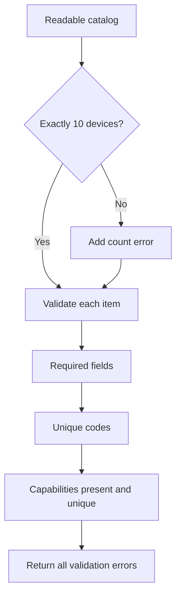

### Interview questions

#### Why is a HashSet useful for duplicate detection?

> It provides average O(1) membership insertion and reports whether a value was
> newly added. A single pass can therefore detect duplicates in average O(n)
> time.

#### Why is the device-code set outside the loop?

> It must retain every previously visited code. Creating it inside the loop erases
> that history on every iteration.

#### Why use `OrdinalIgnoreCase`?

> Device codes are identifiers, not culture-sensitive text. Ordinal
> case-insensitive comparison gives predictable identity semantics.

#### Why return a validation result instead of throwing immediately?

> The catalog is technically readable, but its business content is invalid. A
> structured result reports all fixable problems to the Admin in one response.

---

## 5. Catalog synchronization

### The main question

Synchronization compares two sources:

```text
Desired state: device-catalog.json
Current state: SQL Server Devices table
```

The catalog says what should currently exist. SQL contains current and historical
domain state.

### Synchronization outcomes

| Outcome | Meaning |
| --- | --- |
| `Created` | Catalog code does not exist in SQL |
| `Updated` | Existing metadata or capabilities changed |
| `Unchanged` | Existing active metadata already matches |
| `Retired` | SQL device is absent from the catalog |
| `Restored` | Retired SQL device returned to the catalog |

### Why use a dictionary?

```csharp
var existingDevicesByCode = existingDevices.ToDictionary(
    device => device.Code,
    StringComparer.OrdinalIgnoreCase);
```

Without a dictionary, finding every catalog item in a list could require a nested
scan: O(catalog × database). A dictionary provides average O(1) lookup, producing
an average O(catalog + database) synchronization pass.

### Why use `catalogCodes`?

```csharp
var catalogCodes = new HashSet<string>(
    StringComparer.OrdinalIgnoreCase);
```

The first loop adds all desired codes. The second loop uses this set to find SQL
devices that are no longer present in the catalog.

### Algorithm

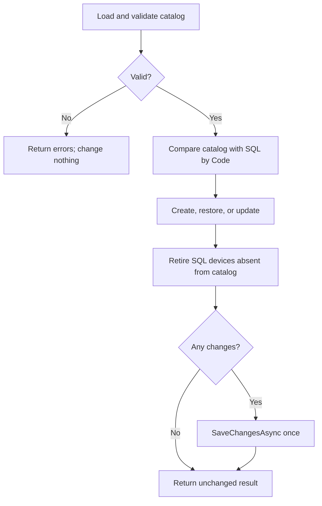

### Core comparison pattern

```csharp
foreach (var item in loadResult.Document.Devices)
{
    catalogCodes.Add(item.Code);

    if (!existingDevicesByCode.TryGetValue(
            item.Code,
            out var existingDevice))
    {
        var newDevice = new Device(
            item.Code,
            item.Name,
            item.HardwareModel,
            item.HardwareRevision,
            item.FirmwareVersion,
            item.Location,
            item.Capabilities,
            synchronizedAtUtc);

        _deviceRepository.Add(newDevice);
        created++;
        hasChanges = true;
        continue;
    }

    var deviceChanged = false;

    if (existingDevice.Restore())
    {
        restored++;
        deviceChanged = true;
    }

    if (existingDevice.UpdateMetadata(
            item.Name,
            item.HardwareModel,
            item.HardwareRevision,
            item.FirmwareVersion,
            item.Location,
            item.Capabilities))
    {
        updated++;
        deviceChanged = true;
    }

    if (!deviceChanged)
    {
        unchanged++;
    }

    hasChanges |= deviceChanged;
}
```

### Retiring missing devices

```csharp
foreach (var existingDevice in existingDevices)
{
    if (catalogCodes.Contains(existingDevice.Code))
    {
        continue;
    }

    if (existingDevice.Retire(synchronizedAtUtc))
    {
        retired++;
        hasChanges = true;
    }
}
```

### Why retire instead of delete?

The first idea was to delete SQL devices missing from JSON to avoid stale rows.
That would destroy identity and history. Retirement is safer:

- telemetry history can still reference the device;
- audit information is preserved;
- returning catalog items can restore the same entity;
- accidental catalog removal is recoverable.

### Save once

```csharp
if (hasChanges)
{
    await _deviceRepository.SaveChangesAsync(cancellationToken);
}
```

Saving after every item creates unnecessary database round trips and can leave a
partially applied catalog. One unit-of-work save is easier to reason about.

### Idempotency

Running the same valid catalog twice should not create duplicate data or generate
false updates.

Example verified responses:

```json
{
  "created": 10,
  "updated": 0,
  "unchanged": 0,
  "retired": 0,
  "restored": 0,
  "hasChanges": true
}
```

```json
{
  "created": 0,
  "updated": 0,
  "unchanged": 10,
  "retired": 0,
  "restored": 0,
  "hasChanges": false
}
```

The second response proves application-level idempotency for unchanged input.

### Invalid input must not modify SQL

```csharp
if (!loadResult.IsValid)
{
    return new DeviceCatalogSynchronizationResult(
        loadResult.ValidationResult,
        Created: 0,
        Updated: 0,
        Unchanged: 0,
        Retired: 0,
        Restored: 0);
}
```

Validation occurs before tracked entities are loaded or changed.

### Concurrency warning

Idempotency of one execution does not automatically make two concurrent
synchronizations safe. Both requests could observe that a code is missing and
try to insert it.

Protection layers include:

- a unique SQL index on `Code`;
- transaction boundaries;
- optimistic concurrency or a synchronization lock when required;
- translating unique-key conflicts into an appropriate result.

### Interview questions

#### What does catalog synchronization do?

> It reconciles desired device state from JSON with current state from SQL. It
> creates missing devices, restores returning devices, updates changed metadata,
> leaves equal devices unchanged, and retires devices absent from the catalog.

#### Why use both a Dictionary and a HashSet?

> The dictionary finds an existing SQL Device by code during the catalog pass.
> The HashSet records all catalog codes so a second SQL pass can identify devices
> that are no longer desired.

#### Why is `SaveChangesAsync` called once?

> The synchronization is one unit of work. A single save reduces round trips and
> lets EF Core persist the tracked changes together.

#### What makes the synchronization idempotent?

> Stable code identity, domain methods that return false when no transition is
> needed, set-based capability comparison, and saving only when state changed.

#### Does idempotency prevent every race condition?

> No. Two idempotent requests can still race when they read the same old state.
> Database constraints and an explicit concurrency strategy are still required.

---

## 6. EF Core and SQL Server

### DbContext

```csharp
public sealed class DeviceManagementDbContext : DbContext
{
    public DeviceManagementDbContext(
        DbContextOptions<DeviceManagementDbContext> options)
        : base(options)
    {
    }

    public DbSet<Device> Devices => Set<Device>();

    protected override void OnModelCreating(ModelBuilder modelBuilder)
    {
        modelBuilder.ApplyConfigurationsFromAssembly(
            typeof(DeviceManagementDbContext).Assembly);
    }
}
```

`DbContext` is EF Core's unit of work and change tracker. It maps domain objects to
SQL operations during `SaveChangesAsync`.

### Entity configuration

```csharp
internal sealed class DeviceConfiguration
    : IEntityTypeConfiguration<Device>
{
    public void Configure(EntityTypeBuilder<Device> builder)
    {
        builder.ToTable("Devices", "device_management");

        builder.HasKey(device => device.Id);

        builder.Property(device => device.Id)
            .ValueGeneratedNever();

        builder.Property(device => device.Code)
            .HasMaxLength(50)
            .UseCollation("Latin1_General_100_CI_AS")
            .IsRequired();

        builder.HasIndex(device => device.Code)
            .IsUnique();
    }
}
```

### Why `ValueGeneratedNever`?

The domain constructor creates the `Guid`. SQL must store that value instead of
generating another identity.

```csharp
Id = Guid.NewGuid();
```

### Why a unique index when validation already checks duplicates?

Application validation provides a friendly error before persistence. The unique
index protects the invariant under concurrency and protects the database from
other writers.

```text
Application validation = early, descriptive protection
SQL unique index       = final integrity protection
```

### Required versus optional timestamps

#### Incorrect mapping that caused the migration error

```csharp
builder.Property(device => device.RegisteredAtUtc)
    .HasColumnType("datetime2")
    .IsRequired(false);
```

`RegisteredAtUtc` is `DateTime`, so it cannot be optional.

#### Correct

```csharp
builder.Property(device => device.RegisteredAtUtc)
    .HasColumnType("datetime2")
    .IsRequired();

builder.Property(device => device.RetiredAtUtc)
    .HasColumnType("datetime2")
    .IsRequired(false);
```

The CLR nullable type and database nullability must agree.

### Enum persistence

```csharp
builder.Property(device => device.Lifecycle)
    .HasConversion<string>()
    .HasMaxLength(50)
    .IsRequired();
```

Storing enum names is readable in SQL and stable when explicit names remain
unchanged. Numeric storage is smaller but less readable and becomes dangerous if
enum numeric ordering is changed.

### Capability persistence and the HashSet problem

The domain wants set semantics, but EF Core primitive collections require a CLR
shape supported by the provider, normally an array or ordered list.

The runtime error was conceptually:

```text
HashSet<DeviceCapability> cannot be used as a primitive collection
because it is not an array and does not implement IList<T>.
```

Another attempted mapping named `HashSet<DeviceCapability>` while the backing
field was a `List<DeviceCapability>`, which also failed because the configured
and actual CLR types did not match.

Correct persistence options include:

1. Use a compatible private `List<DeviceCapability>` for EF persistence and
   enforce uniqueness in domain methods.
2. Use a value converter that serializes a set to one JSON/string column.
3. Model capabilities in a separate relational table.

The MVP uses one required SQL column. Whichever option is selected, the mapping
type must exactly match the CLR field type, while the public domain API must still
prevent duplicates.

### Migration workflow

```powershell
dotnet ef migrations add InitialDeviceManagement `
  --project src/AssetMonitoring.Modules.DeviceManagement `
  --startup-project src/AssetMonitoring.Api `
  --context DeviceManagementDbContext `
  --output-dir Infrastructure/Persistence/Migrations

dotnet ef database update `
  --project src/AssetMonitoring.Modules.DeviceManagement `
  --startup-project src/AssetMonitoring.Api `
  --context DeviceManagementDbContext
```

The module project contains the context and migrations. The API is the startup
project because it provides runtime configuration and DI registration.

### Why did the startup project need `Microsoft.EntityFrameworkCore.Design`?

EF tooling builds and executes the startup project to create the context at
design time. It therefore needs access to the design-time tooling package.

### Should migrations be added to `.gitignore`?

No. Migration source files and the model snapshot describe the database schema
history and should normally be committed.

Ignore generated runtime output such as `bin/` and `obj/`, not migration source
code.

### Tracked and untracked queries

Synchronization needs tracked entities because domain methods modify them before
`SaveChangesAsync`:

```csharp
await _dbContext.Devices.ToListAsync(cancellationToken);
```

Read-only queries should avoid tracking overhead:

```csharp
var query = _dbContext.Devices.AsNoTracking();
```

### Interview questions

#### What is the purpose of DbContext?

> It represents an EF Core unit of work, tracks entity changes, translates LINQ
> queries, and persists tracked modifications to the database.

#### Why configure Device in a separate class?

> `IEntityTypeConfiguration<Device>` keeps persistence mapping out of the domain
> entity and prevents `OnModelCreating` from becoming one very large method.

#### Why use both app validation and a database unique index?

> Validation gives a useful business response, while the unique index guarantees
> integrity even under concurrent requests or writes outside that validation
> path.

#### Why does synchronization use tracking but GET queries use `AsNoTracking`?

> Synchronization changes loaded entities and needs EF to detect those changes.
> GET endpoints only project data, so tracking would consume memory without
> providing value.

#### What is an EF Core migration?

> It is versioned source code describing how to move the database schema forward
> or backward so schema evolution can be reviewed and reproduced.

---

## 7. Repository, queries, DTOs, and API

### Repository command boundary

```csharp
public interface IDeviceRepository
{
    Task<IReadOnlyList<Device>> GetAllAsync(
        CancellationToken cancellationToken = default);

    void Add(Device device);

    Task SaveChangesAsync(
        CancellationToken cancellationToken = default);
}
```

The repository supports the application use case that loads tracked entities,
applies domain behavior, adds new entities, and saves the unit of work.

### Why is `Add` synchronous?

`DbSet.Add` only starts tracking an entity in memory. It does not perform database
I/O. The asynchronous database operation is `SaveChangesAsync`.

```csharp
public void Add(Device device)
{
    ArgumentNullException.ThrowIfNull(device);
    _dbContext.Devices.Add(device);
}
```

Naming a method `AddNewDeviceAsync` without asynchronous work would be misleading.

### Query abstraction

Read operations return DTOs and do not expose tracked domain entities:

```csharp
public interface IDeviceQueries
{
    Task<IReadOnlyList<DeviceResponse>> GetAllAsync(
        DeviceLifecycle? lifecycle = null,
        CancellationToken cancellationToken = default);

    Task<DeviceResponse?> GetByCodeAsync(
        string code,
        CancellationToken cancellationToken = default);
}
```

This is a lightweight command/query separation:

| Abstraction | Purpose |
| --- | --- |
| `IDeviceRepository` | Load and persist domain entities for commands |
| `IDeviceQueries` | Execute read-only queries and return response DTOs |

### Why not give the controller `IDeviceRepository`?

The controller needs read models, not tracked domain entities. Depending on
`IDeviceQueries` exposes only the operations the controller needs and avoids
leaking persistence behavior into the HTTP layer.

### DeviceResponse DTO

```csharp
public sealed class DeviceResponse
{
    public required Guid Id { get; init; }
    public required string Code { get; init; }
    public required string Name { get; init; }
    public required string HardwareModel { get; init; }
    public required string HardwareRevision { get; init; }
    public required string FirmwareVersion { get; init; }
    public required string Location { get; init; }
    public required IReadOnlyCollection<DeviceCapability> Capabilities { get; init; }
    public required DateTime RegisteredAtUtc { get; init; }
    public required DeviceLifecycle Lifecycle { get; init; }
    public DateTime? RetiredAtUtc { get; init; }
}
```

`RetiredAtUtc` remains nullable. Marking it as `required DateTime` would contradict
the domain and database model.

### Query implementation

```csharp
public async Task<IReadOnlyList<DeviceResponse>> GetAllAsync(
    DeviceLifecycle? lifecycle = null,
    CancellationToken cancellationToken = default)
{
    var query = _dbContext.Devices.AsNoTracking();

    if (lifecycle.HasValue)
    {
        query = query.Where(
            device => device.Lifecycle == lifecycle.Value);
    }

    var devices = await query
        .OrderBy(device => device.Code)
        .ToListAsync(cancellationToken);

    return devices.Select(Map).ToList();
}
```

The nullable filter means:

```text
lifecycle == null  → return all lifecycles
lifecycle has value → apply WHERE Lifecycle = value
```

### Mapping

```csharp
private static DeviceResponse Map(Device device) =>
    new()
    {
        Id = device.Id,
        Code = device.Code,
        Name = device.Name,
        HardwareModel = device.HardwareModel,
        HardwareRevision = device.HardwareRevision,
        FirmwareVersion = device.FirmwareVersion,
        Location = device.Location,
        Capabilities = device.Capabilities.ToArray(),
        Lifecycle = device.Lifecycle,
        RegisteredAtUtc = device.RegisteredAtUtc,
        RetiredAtUtc = device.RetiredAtUtc
    };
```

The response owns a snapshot array instead of exposing the entity's backing
collection.

### The missing `await` bug

#### Incorrect controller

```csharp
var devices = _deviceQueries.GetAllAsync(
    lifecycle,
    cancellationToken);

return Ok(devices);
```

This sends a `Task` object to JSON serialization. The serializer then tries to
inspect internal async state-machine fields and fails with an error involving
`AsyncStateMachineBox` or `ExecutionContext&`.

#### Correct

```csharp
var devices = await _deviceQueries.GetAllAsync(
    lifecycle,
    cancellationToken);

return Ok(devices);
```

Now the response contains the completed `IReadOnlyList<DeviceResponse>`.

### GET by code

```csharp
[HttpGet("{code}")]
[ProducesResponseType<DeviceResponse>(StatusCodes.Status200OK)]
[ProducesResponseType<ProblemDetails>(StatusCodes.Status404NotFound)]
public async Task<ActionResult<DeviceResponse>> GetByCodeAsync(
    [FromRoute] string code,
    CancellationToken cancellationToken)
{
    var device = await _deviceQueries.GetByCodeAsync(
        code,
        cancellationToken);

    if (device is null)
    {
        return Problem(
            statusCode: StatusCodes.Status404NotFound,
            title: "Device not found.",
            detail: $"A device with code '{code}' was not found.",
            instance: HttpContext.Request.Path);
    }

    return Ok(device);
}
```

### Synchronization is POST, not GET

Validation is read-only and may use GET. Synchronization changes SQL state and
therefore uses POST:

```text
GET  /api/device-catalog/validation  → read and report
POST /api/device-catalog/synchronize → change server state
```

### Correct path passed to synchronization

The controller must pass the full catalog file path, not only
`ContentRootPath`:

```csharp
var path = Path.Combine(
    _environment.ContentRootPath,
    "Configuration",
    "DeviceCatalog",
    "device-catalog.json");

var result = await _synchronizationService.SynchronizeAsync(
    path,
    cancellationToken);
```

### API flow

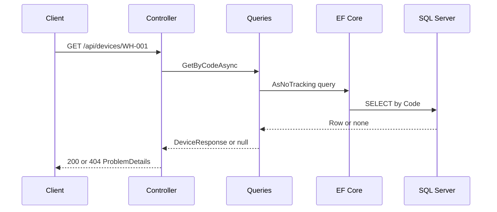

### JSON enum output

Without a response converter, enums are serialized as `0`, `1`, `2`, and `3`.
The API configures string enum output:

```csharp
builder.Services
    .AddControllers()
    .AddJsonOptions(options =>
    {
        options.JsonSerializerOptions.Converters.Add(
            new JsonStringEnumConverter(
                allowIntegerValues: false));
    });
```

An API response is then readable:

```json
{
  "capabilities": ["Temperature", "Humidity"],
  "lifecycle": "Registered"
}
```

### Interview questions

#### Why separate repository and query interfaces?

> Commands need tracked domain entities and save behavior. Queries need efficient
> read-only projections. Separate interfaces keep each client dependent only on
> the operations it uses.

#### Why is `DeviceResponse` separate from `Device`?

> The API contract should not expose an EF-tracked domain entity or its private
> persistence details. A DTO provides a stable, immutable response shape.

#### Why use `ProblemDetails` for not found?

> It provides a standardized machine-readable HTTP error with status, title,
> detail, request instance, and trace information.

#### Why did returning `Ok(task)` fail?

> The action returned the Task object instead of awaiting it. JSON serialization
> tried to serialize internal Task state rather than the query result.

#### Why is synchronization a POST endpoint?

> It can create, update, retire, and restore database records. GET must be safe and
> must not produce that kind of server-side state change.

---

# Part II — Theory demonstrated by the project

## 8. SOLID

### Overview

| Principle | Short meaning | AssetMonitoring example |
| --- | --- | --- |
| SRP | One reason to change | Reader, validator, sync service, repository |
| OCP | Extend without repeatedly modifying stable logic | Reader implementations |
| LSP | Implementations preserve the abstraction's contract | JSON/XML readers |
| ISP | Clients depend only on methods they need | Queries vs repository |
| DIP | High-level policy depends on abstractions | Sync service uses repository interface |

### S — Single Responsibility Principle

> A component should have one responsibility and one reason to change.

SRP does not mean one method per class. Several methods can support the same
responsibility.

#### Correct

```text
JSON reader      → parsing changes
Validator        → catalog-rule changes
Sync service     → reconciliation-rule changes
Repository       → persistence changes
```

#### Incorrect

```csharp
public sealed class JsonDeviceCatalogReader
{
    public async Task ReadValidateAndSaveAsync(...)
    {
        // File I/O + parsing + rules + SQL.
    }
}
```

#### Interview question: What does SRP mean?

> A class should have one coherent responsibility and therefore one main reason
> to change. In AssetMonitoring, catalog reading, validation, synchronization,
> and persistence are separated because they change independently.

### O — Open/Closed Principle

> Software should be open for extension but closed for repeated modification.

#### Correct extension

```csharp
public sealed class XmlDeviceCatalogReader : IDeviceCatalogReader
{
    public Task<DeviceCatalogDocument> ReadAsync(...)
    {
        // XML-specific implementation.
    }
}
```

The loader continues to depend on the same abstraction.

#### Incorrect modification pattern

```csharp
if (extension == ".json") { ... }
else if (extension == ".xml") { ... }
else if (extension == ".yaml") { ... }
```

Every new format modifies one growing conditional.

#### Should `ReadXmlAsync` be added to the interface?

No. A JSON implementation would be forced to implement a method it cannot use.
The abstraction should describe the generic operation `ReadAsync`.

#### Interview question: Does OCP mean existing code can never change?

> No. Existing code can be fixed and refactored. OCP means that adding a normal
> variation should preferably use an extension point instead of repeatedly
> rewriting stable behavior.

### L — Liskov Substitution Principle

> Every implementation of an abstraction must preserve the behavior promised by
> that abstraction.

An implementation should not strengthen preconditions, weaken postconditions,
or violate invariants.

#### Incorrect return contract

```csharp
public Task<DeviceCatalogDocument> ReadAsync(...)
{
    return Task.FromResult<DeviceCatalogDocument>(null!);
}
```

If callers expect a non-null document, this implementation cannot safely replace
the normal reader.

#### Incorrect stronger precondition

```text
Interface contract: relative or absolute valid path
New implementation: absolute path only
```

The new implementation rejects input that the abstraction permits.

#### Exceptions and LSP

LSP does not mean an implementation may never throw. File-not-found,
cancellation, and malformed-input exceptions can be natural parts of a reader's
contract. The problem is surprising behavior that callers could not reasonably
expect from the abstraction.

#### Interview question: What is LSP?

> Implementations must be safely substitutable for the abstraction. They must
> preserve its accepted input, promised output, invariants, and expected failure
> behavior.

### I — Interface Segregation Principle

> Clients should not depend on methods they do not use.

#### Incorrect large interface

```csharp
public interface IDeviceService
{
    Task<IReadOnlyList<Device>> GetAllAsync();
    void Add(Device device);
    Task SaveChangesAsync();
    Task SendNotificationAsync();
    Task ReadCatalogAsync();
}
```

#### Correct focused contracts

```text
DevicesController                   → IDeviceQueries
DeviceCatalogSynchronizationService → IDeviceRepository
DeviceCatalogLoader                 → IDeviceCatalogReader
```

#### Interview question: Why separate queries and repository?

> The controller needs read operations but not tracking or saving. The
> synchronization service needs tracked entities and persistence. Separate
> interfaces prevent each client from depending on unrelated methods.

### D — Dependency Inversion Principle

> High-level policy should not depend directly on low-level implementation
> details. Both should depend on abstractions.

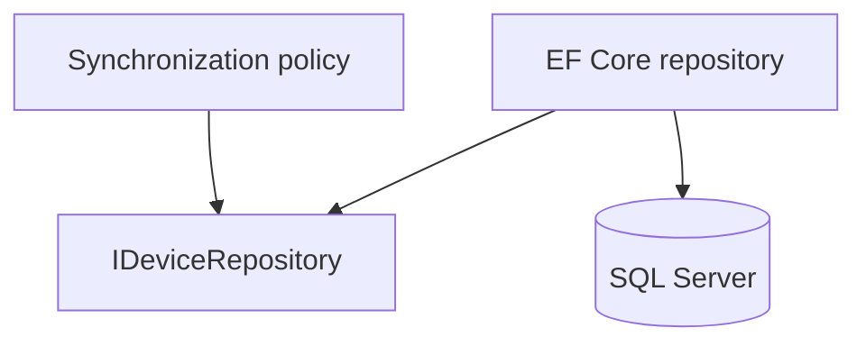

#### Incorrect

```csharp
public DeviceCatalogSynchronizationService()
{
    _repository = new DeviceRepository(/* EF configuration */);
}
```

The business use case now constructs and knows infrastructure details.

#### Correct

```csharp
public DeviceCatalogSynchronizationService(
    IDeviceRepository repository)
{
    _repository = repository;
}
```

#### Interview question: Is Dependency Injection the same as DIP?

> No. DIP is the design principle that policy depends on abstractions.
> Dependency Injection is a technique for supplying an object's dependencies.
> A DI container is a tool that can automate construction and lifetime handling.

### SOLID rapid answer

> In AssetMonitoring, SRP separates reading, validation, synchronization,
> querying, and persistence. OCP is supported by the reader abstraction, which
> allows new formats through new implementations. LSP requires every reader to
> preserve the same contract. ISP is demonstrated by separating query and
> repository interfaces. DIP is demonstrated by the synchronization use case
> depending on `IDeviceRepository`, not directly on EF Core.

---

## 9. Dependency Injection fundamentals

### Three concepts that must not be mixed

| Concept | Meaning |
| --- | --- |
| Dependency Inversion Principle | Architecture depends on abstractions |
| Dependency Injection | Dependencies are supplied from outside |
| DI container | Tool that constructs object graphs and manages lifetimes |

### Constructor injection

```csharp
public sealed class DeviceCatalogLoader
{
    private readonly IDeviceCatalogReader _reader;
    private readonly DeviceCatalogValidator _validator;

    public DeviceCatalogLoader(
        IDeviceCatalogReader reader,
        DeviceCatalogValidator validator)
    {
        _reader = reader;
        _validator = validator;
    }
}
```

The class declares what it needs. It does not decide how those objects are
created.

### Manual Dependency Injection

```csharp
var reader = new JsonDeviceCatalogReader();
var validator = new DeviceCatalogValidator();
var loader = new DeviceCatalogLoader(reader, validator);
```

This is still Dependency Injection because the dependencies are created outside
and passed through the constructor. No DI container is required for the concept.

### DI container registration

```csharp
services.AddSingleton<IDeviceCatalogReader, JsonDeviceCatalogReader>();
services.AddSingleton<DeviceCatalogValidator>();
services.AddSingleton<DeviceCatalogLoader>();
```

The container stores service descriptions, not simply a database of class
instances.

### Registration, resolution, and activation

| Term | What happens |
| --- | --- |
| Registration | A service type, implementation, factory, and lifetime are configured |
| Resolution | A service is requested from the container |
| Activation | The container chooses a constructor and creates the object graph |

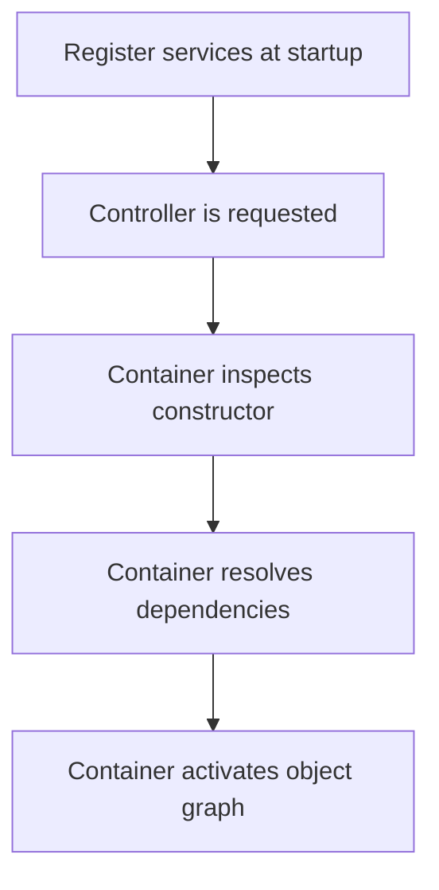

### Composition root

Registration belongs in `Program.cs` or module extension methods:

```csharp
public static IServiceCollection AddDeviceManagement(
    this IServiceCollection services,
    string connectionString)
{
    services.AddDbContext<DeviceManagementDbContext>(
        options => options.UseSqlServer(connectionString));

    services.AddScoped<IDeviceRepository, DeviceRepository>();
    services.AddScoped<IDeviceQueries, DeviceQueries>();
    services.AddScoped<DeviceCatalogSynchronizationService>();

    services.AddSingleton<IDeviceCatalogReader, JsonDeviceCatalogReader>();
    services.AddSingleton<DeviceCatalogValidator>();
    services.AddSingleton<DeviceCatalogLoader>();
    services.AddSingleton<TimeProvider>(TimeProvider.System);

    return services;
}
```

### Service Locator anti-pattern

#### Incorrect

```csharp
public sealed class DeviceService
{
    private readonly IServiceProvider _services;

    public async Task ExecuteAsync()
    {
        var repository =
            _services.GetRequiredService<IDeviceRepository>();

        // Work.
    }
}
```

Dependencies are hidden and errors move from construction time to runtime.

#### Preferred

```csharp
public DeviceService(IDeviceRepository repository)
{
    _repository = repository;
}
```

Explicit scope creation in a Singleton background worker is a justified boundary,
not a normal replacement for constructor injection.

### Interview questions

#### What is Dependency Injection?

> It is the technique of supplying an object's dependencies from outside rather
> than letting the object construct them itself.

#### What does a DI container do?

> It stores registrations, resolves services, activates object graphs, manages
> configured lifetimes, and disposes owned disposable services.

#### Is registration itself Dependency Injection?

> No. Registration configures a container. Injection happens when a dependency is
> supplied to an object, commonly through its constructor.

#### Why is constructor injection preferred?

> Dependencies are explicit, the object can be valid immediately after
> construction, and tests can provide substitutes without accessing a container.

---

## 10. Dependency Injection lifetimes

### The exact definitions

| Lifetime | Correct definition |
| --- | --- |
| Transient | A new instance for every DI resolution |
| Scoped | One instance per DI scope |
| Singleton | One instance per root container/application lifetime |

### What is a scope?

A scope is both a lifetime boundary and an ownership boundary. Scoped services
are reused within it, and disposable objects owned by the scope are cleaned up
when it ends.

ASP.NET Core automatically creates one scope for each HTTP request.

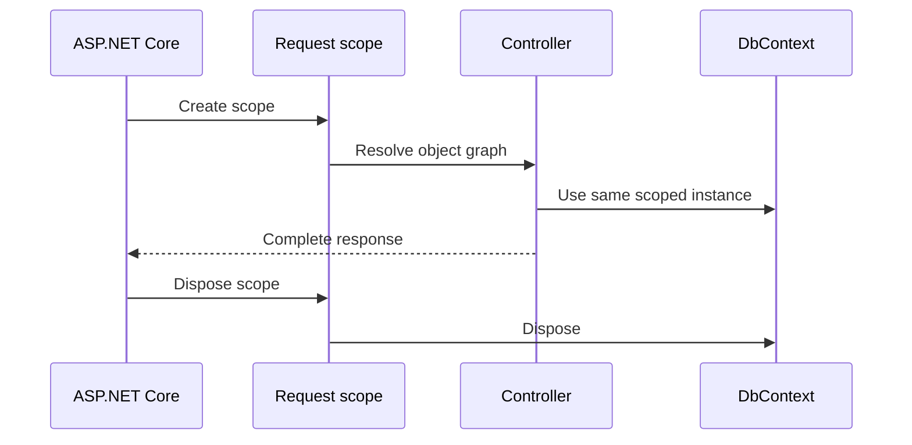

A scope can also represent one background-job iteration or one consumed message.

### Transient

```csharp
services.AddTransient<IReportFormatter, ReportFormatter>();
```

> A new instance is created each time the service is resolved.

#### Common wrong answer

> “Transient creates one new instance for every HTTP request.”

That is Scoped. Transient is per resolution.

```text
One HTTP request
├── Consumer A resolution → Formatter instance 1
└── Consumer B resolution → Formatter instance 2
```

Calling a method does not perform another DI resolution:

```csharp
_formatter.Format(firstReport);
_formatter.Format(secondReport);
```

Both calls use the same `_formatter` field already injected into that consumer.

Transient is usually appropriate for lightweight stateless helpers when a fresh
instance per resolution is useful.

### Scoped

```csharp
services.AddScoped<IDeviceRepository, DeviceRepository>();
```

> One instance is created and reused inside one scope. A different scope gets a
> different instance.

#### Common incomplete answer

> “Scoped is for database communication.”

EF Core is the most common example, but the definition is broader. Scoped means
one instance per operation boundary, which is normally one HTTP request.

```text
Request A → Repository A → DbContext A
Request B → Repository B → DbContext B
```

Within Request A, every consumer of the same scoped registration receives the
same scoped instance.

### Singleton

```csharp
services.AddSingleton<DeviceCatalogValidator>();
```

> One instance is shared through the root container, normally for the entire
> application lifetime.

A Singleton is usually created lazily the first time it is resolved, not
necessarily during startup.

The same object may be used by many concurrent requests. It must therefore be:

- stateless, immutable, or properly synchronized;
- free of request-specific mutable fields;
- dependent only on lifetime-compatible services.

### All lifetimes across two requests

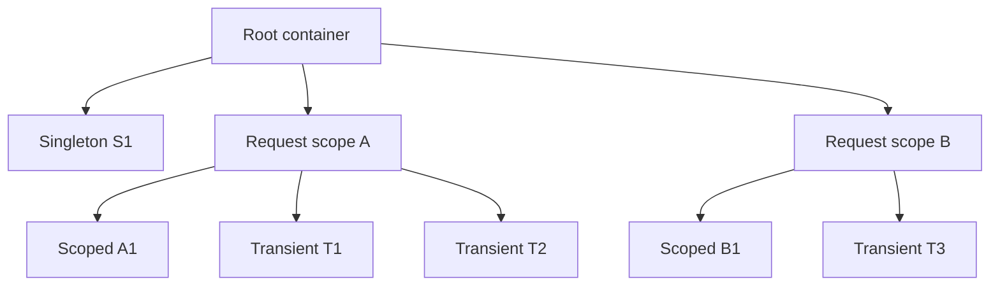

Both request scopes use the same Singleton S1.

### AssetMonitoring lifetime table

| Service | Lifetime | Why |
| --- | --- | --- |
| `DeviceManagementDbContext` | Scoped | Non-thread-safe unit of work and change tracker |
| `IDeviceRepository` | Scoped | Uses the request's context |
| `IDeviceQueries` | Scoped | Uses the request's context for queries |
| `DeviceCatalogSynchronizationService` | Scoped | Coordinates one SQL unit of work |
| `IDeviceCatalogReader` | Singleton | Stateless; stream is local to each call |
| `DeviceCatalogValidator` | Singleton | Stateless; errors are local variables |
| `DeviceCatalogLoader` | Singleton | Stateless coordinator with Singleton dependencies |
| `TimeProvider` | Singleton | Shared thread-safe time abstraction |

### Why DbContext must not be Singleton

`DbContext`:

- is not thread-safe;
- stores tracked entities and their original values;
- represents a short unit of work;
- should not mix unrelated requests.

#### Incorrect

```csharp
services.AddSingleton<DeviceManagementDbContext>();
```

Possible results:

- concurrent-operation exceptions;
- one request seeing another request's tracked entities;
- stale tracked state;
- incorrect combined changes;
- change tracker growing for the whole application lifetime.

#### Correct graph

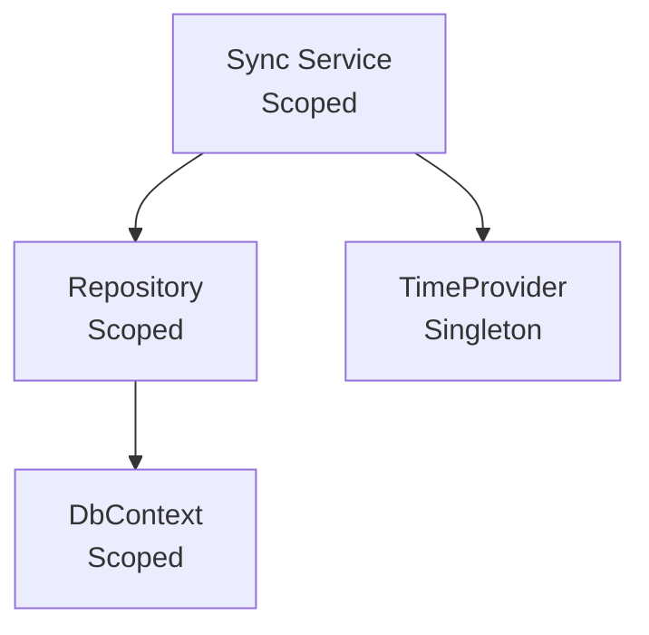

### Lifetime compatibility

The consumer is shown in the first column; dependencies are shown across the top.

| Consumer | Singleton dependency | Scoped dependency | Transient dependency |
| --- | --- | --- | --- |
| Singleton | Safe | Invalid direct capture | Captured; effectively long-lived |
| Scoped | Safe | Safe within the same scope | Safe; retained by that consumer |
| Transient | Safe | Safe only inside a valid scope | Safe |

### Captive dependency

A longer-lived object captures a shorter-lived dependency beyond its intended
lifetime.

#### Incorrect Singleton to Scoped graph

```csharp
public sealed class HeartbeatMonitor : BackgroundService
{
    public HeartbeatMonitor(IDeviceRepository repository)
    {
        _repository = repository;
    }
}
```

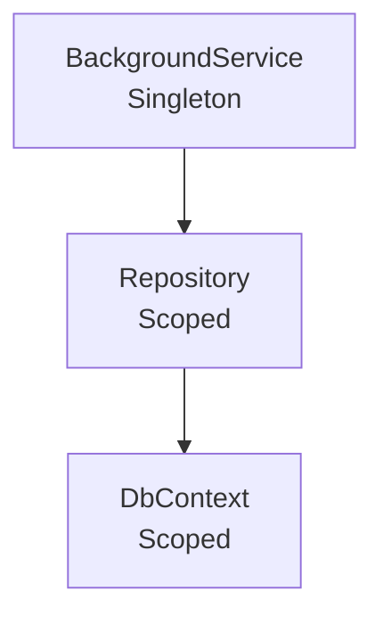

The worker would keep one request-style repository and context for too long.
Scope validation should reject this graph.

### Singleton capturing Transient

Consider this registration:

```csharp
services.AddTransient<DeviceCatalogValidator>();
services.AddSingleton<DeviceCatalogLoader>();
```

The loader constructor resolves one validator. Because the loader stores it in a
field, that particular “Transient” now remains reachable for the loader's
Singleton lifetime.

```text
Registered lifetime: Transient
Effective captured lifetime: Singleton
```

A new validator is not created for each `LoadAsync` method call. Transient means
per DI resolution, not per method invocation.

### Scoped capturing Transient

```text
SynchronizationService (Scoped)
        ↓ constructor capture
Transient helper
```

That particular helper usually lives until the scoped consumer and request end.
A different consumer resolved in the same request can still receive another
Transient instance.

### Scoped does not serialize requests

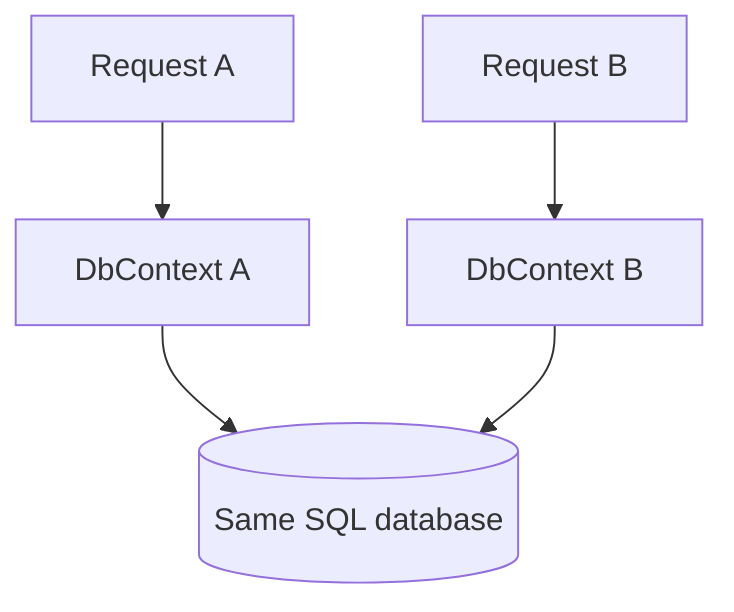

Scopes isolate object instances; they do not make Request B wait for Request A.
Database constraints, transactions, idempotency, optimistic concurrency, or a
lock are separate concerns.

### Background worker using scoped services correctly

Hosted `BackgroundService` objects are Singleton. Create an explicit scope for
each iteration:

```csharp
public sealed class HeartbeatMonitor : BackgroundService
{
    private readonly IServiceScopeFactory _scopeFactory;

    public HeartbeatMonitor(IServiceScopeFactory scopeFactory)
    {
        _scopeFactory = scopeFactory;
    }

    protected override async Task ExecuteAsync(
        CancellationToken stoppingToken)
    {
        while (!stoppingToken.IsCancellationRequested)
        {
            await using var scope =
                _scopeFactory.CreateAsyncScope();

            var checker = scope.ServiceProvider
                .GetRequiredService<IHeartbeatCheckService>();

            await checker.CheckAsync(stoppingToken);
        }
    }
}
```

Resolve a scoped application service, not many repositories individually. The
application service coordinates one background unit of work.

### Disposal by lifetime

| Lifetime | Normal disposal time when DI owns it |
| --- | --- |
| Transient resolved inside a scope | When the owning scope ends |
| Scoped | When the scope ends |
| Singleton | When the root container shuts down |

A disposable Transient is not automatically disposed after one method call.

### Choosing a lifetime

Ask these questions:

1. Does the service contain mutable state?
2. Who should share that state?
3. Does it depend on a scoped unit of work?
4. Is it safe under concurrent use?
5. Who owns and disposes its resources?

Use the shortest lifetime that correctly matches the ownership and sharing
requirements. Do not select Singleton only to avoid allocations.

### Interview questions

#### Define all three DI lifetimes.

> Transient creates a new instance per resolution. Scoped creates one instance
> per scope, normally one HTTP request. Singleton creates one instance per root
> container and shares it for the application lifetime.

#### What is a DI scope?

> It is a lifetime and ownership boundary. Scoped services are reused inside it,
> and owned disposable services are cleaned up when it ends.

#### Is a Singleton always created during application startup?

> No. With the normal registration overload it is usually created lazily on the
> first resolution and then reused. Code can force eager resolution, but that is
> a separate choice.

#### Can two Transient instances exist in one request?

> Yes. Two separate resolutions in the same request can create two instances.

#### Is a Transient created on every method call?

> No. It is created on DI resolution. Calling methods on an already injected
> field uses that same instance.

#### How long does a Transient injected into a Scoped service live?

> That particular instance is retained by the Scoped consumer and normally
> remains reachable until the scope ends. Another resolution can still create a
> different Transient.

#### Can a Scoped service depend on a Singleton?

> Yes. The Singleton outlives the Scoped consumer. The Singleton must still be
> thread-safe because many scopes can use it concurrently.

#### Can a Singleton depend directly on a Scoped service?

> No. That creates a captive dependency and keeps the Scoped object beyond its
> intended boundary.

#### Can a Singleton depend on another Singleton?

> Yes, provided both are safe for application-wide concurrent use. That is why
> the Singleton catalog loader can use the Singleton reader and validator.

#### Why is synchronization service Scoped?

> It depends on a Scoped repository and DbContext and represents one database
> unit of work for one request.

#### Is the validator safe as Singleton?

> Yes, because it stores no mutable validation state in fields. Every call creates
> its own local error collection. A shared `_errors` field would not be safe.

#### Does Scoped prevent a race condition?

> No. It isolates instances per request but requests can still execute
> concurrently against the same database.

#### How can a Singleton background worker use a Scoped repository?

> Inject `IServiceScopeFactory`, create a scope for one iteration or message,
> resolve a scoped application service from it, await the operation, and dispose
> the scope. Do not retain the resolved service after the scope ends.

#### Is an explicit scope disposed when its operation throws?

> Yes when it is declared with `using` or `await using`. Cleanup runs as execution
> leaves the block, and the original exception then continues propagating unless
> it is caught.

#### Who disposes DbContext?

> The DI container disposes the Scoped DbContext when its request or explicit
> scope ends. A repository must not manually dispose the injected context.

#### How should a DI lifetime be selected?

> Select it from ownership, sharing, mutable state, thread safety, and dependency
> lifetimes. Use the shortest lifetime that correctly represents the service;
> do not choose Singleton only as a performance shortcut.

### Short interview answer

> Transient means per resolution, Scoped means per scope, and Singleton means one
> instance for the root container lifetime. ASP.NET Core creates one scope per
> request. `DbContext`, repositories, and the synchronization service are Scoped
> because they form one non-thread-safe unit of work. Stateless catalog services
> can be Singletons. A longer-lived service must not capture a shorter-lived
> service, so a Singleton worker creates an explicit scope when it needs database
> services.

---

## 11. `IDisposable` and `IAsyncDisposable`

### The real purpose

`IDisposable` provides deterministic cleanup. It does not directly free the
managed C# object from memory.

Typical resources include:

- file and OS handles;
- streams;
- database connections;
- sockets;
- timers and registrations;
- managed objects that themselves implement `IDisposable`;
- directly owned unmanaged resources.

### `using` and `try/finally`

```csharp
using var stream = File.OpenRead(path);
// Use stream.
```

Conceptually behaves like:

```csharp
var stream = File.OpenRead(path);

try
{
    // Use stream.
}
finally
{
    stream.Dispose();
}
```

If work throws, `Dispose` still runs. `using` does not catch the exception; the
exception continues propagating after cleanup.

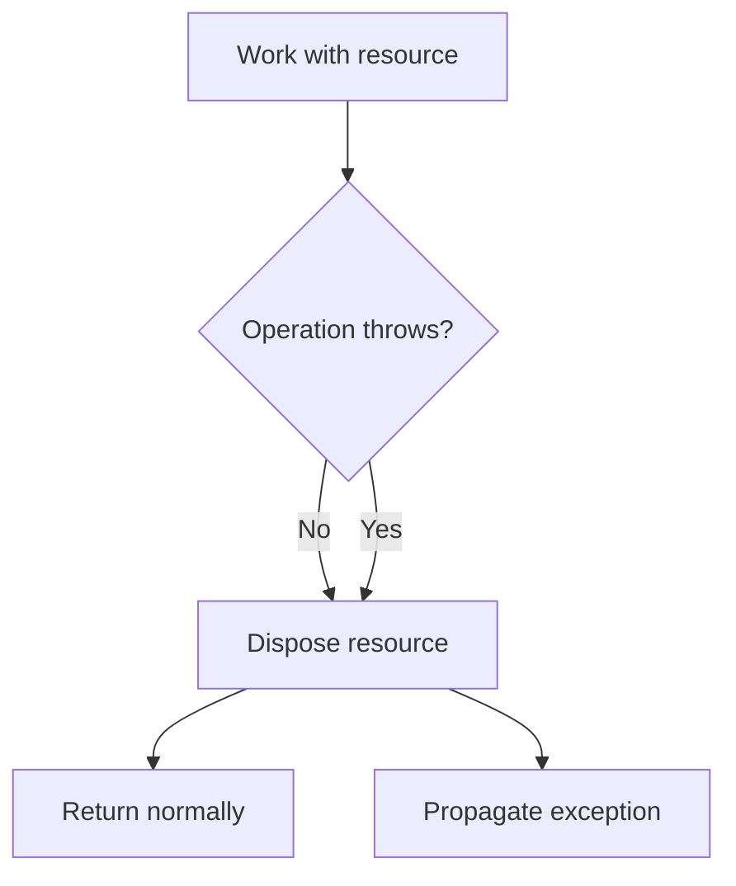

Only one of the final branches occurs, depending on the original outcome.

### `IAsyncDisposable`

```csharp
public interface IAsyncDisposable
{
    ValueTask DisposeAsync();
}
```

| Syntax | Cleanup |
| --- | --- |
| `using` | `Dispose()` |
| `await using` | `await DisposeAsync()` |

Asynchronous cleanup is useful when closing or flushing can involve I/O.

### AssetMonitoring JSON reader

```csharp
await using var stream = File.OpenRead(path);

var document = await JsonSerializer.DeserializeAsync<DeviceCatalogDocument>(
    stream,
    SerializerOptions,
    cancellationToken);
```

The stream is created, used, and disposed inside one method call. Therefore
`JsonDeviceCatalogReader` itself does not implement `IDisposable`.

### When should the containing class implement IDisposable?

When it creates and keeps a disposable resource as part of its own lifetime:

```csharp
public sealed class ReportService : IDisposable
{
    private readonly FileStream _stream =
        File.OpenWrite("report.txt");

    public void Dispose()
    {
        _stream.Dispose();
    }
}
```

The owner must then be disposed:

```csharp
using var service = new ReportService();
```

### Ownership rule

> The code that creates and owns a disposable resource is normally responsible
> for disposing it.

| Resource creation | Normal owner |
| --- | --- |
| Local `File.OpenRead` | The method with `using` |
| `new DbContext(...)` | The creating code |
| DbContext injected by DI | The DI scope/container |
| Externally created Singleton instance | The external creator |

The repository must not dispose an injected DbContext because it does not own it.

### Dispose versus Garbage Collector

```text
Dispose → releases owned resources at a known time
GC      → later reclaims unreachable managed memory
```

The operating system releases handles when the process dies, but terminating a
process is not a resource-management technique.

### Finalizer

```csharp
~UnmanagedResourceOwner()
{
    // Emergency cleanup.
}
```

A finalizer is non-deterministic and normally needed only for a class that
directly owns an unmanaged resource. Modern code should prefer `SafeHandle`.

Most classes that only own a `FileStream` do not need their own finalizer; the
stream already owns an appropriate safe handle.

### `GC.SuppressFinalize`

```csharp
public void Dispose()
{
    Dispose(true);
    GC.SuppressFinalize(this);
}
```

It does not release anything itself. It tells the GC that finalization is no
longer necessary because deterministic cleanup already completed.

### Interview questions

#### What problem does IDisposable solve?

> It provides deterministic cleanup for owned resources instead of waiting for
> non-deterministic garbage collection or process termination.

#### Does using catch exceptions?

> No. It guarantees cleanup through a finally-like mechanism and then allows the
> exception to keep propagating.

#### What is the difference between IDisposable and IAsyncDisposable?

> `IDisposable.Dispose` performs synchronous cleanup. `IAsyncDisposable.DisposeAsync`
> allows cleanup to be awaited when it involves asynchronous work.

#### Does an async class always use await using?

> Classes are not async; methods are. An async method can use ordinary `using` for
> synchronous disposal and `await using` when the resource supports asynchronous
> disposal.

#### Why does JsonDeviceCatalogReader not implement IDisposable?

> It does not retain the stream as a field. Each method call creates and disposes
> its own local stream.

#### Does Dispose remove the object from managed memory?

> No. It releases resources. The GC later reclaims managed memory when the object
> is unreachable.

#### Does every IDisposable implementation need a finalizer?

> No. A finalizer is normally needed only when a class directly owns an unmanaged
> resource. A class that owns managed disposable objects usually disposes them
> without declaring another finalizer.

#### What does `GC.SuppressFinalize(this)` do?

> It tells the GC not to run this object's finalizer because deterministic cleanup
> already completed. It does not release the resource itself.

#### Who disposes an injected DbContext?

> The DI container that created it disposes it with the request scope. The
> repository must not dispose it early.

---

## 12. Async/await

### What `async` means

The `async` keyword allows `await` and enables compiler-generated state-machine
behavior. It does not automatically create another thread.

An async method starts when it is called and runs synchronously until it reaches
an incomplete awaited operation.

### What happens at an incomplete await?

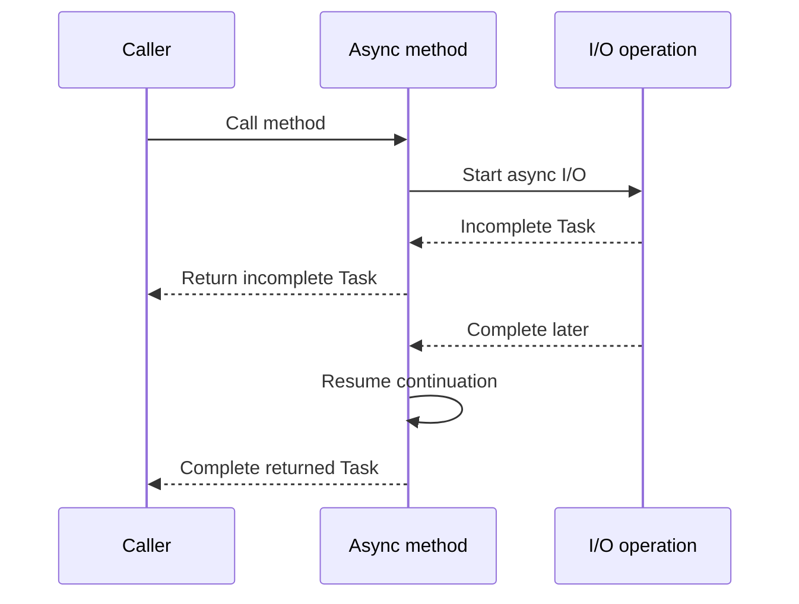

The method saves its state and returns an incomplete Task. The current thread is
free to perform other work. When the operation completes, execution continues
after `await`.

If the Task is already complete, `await` continues synchronously without yielding.

### Task is not a thread

`Task` represents the completion of an operation:

```csharp
Task                 // no result value
Task<DeviceResponse> // result value
```

An I/O Task can be incomplete without any thread sitting blocked for the whole
wait. `Task.Run` uses the Thread Pool, but `await` itself does not create or
guarantee a thread.

### I/O-bound versus CPU-bound

| Work | Kind | Preferred approach |
| --- | --- | --- |
| EF Core SQL query | I/O | Native async API |
| Read JSON file | I/O | Native async API |
| HTTP call | I/O | Native async API |
| Large calculation | CPU | Direct work or planned parallelism |
| Heavy calculation in WPF | CPU | `Task.Run` may keep UI responsive |

#### Incorrect server code

```csharp
await Task.Run(async () =>
    await _dbContext.Devices.ToListAsync(cancellationToken));
```

EF Core already exposes asynchronous I/O. Wrapping it adds Thread Pool overhead.

### Async all the way

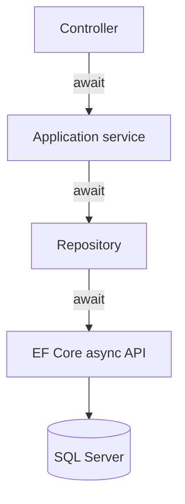

Every layer returns a Task and awaits the downstream operation.

### `.Result` and `.Wait()`

#### Incorrect

```csharp
var devices = _deviceQueries.GetAllAsync().Result;
```

This synchronously blocks the current thread. On servers it reduces scalability
and can contribute to Thread Pool starvation. In UI applications it can deadlock.

#### Correct

```csharp
var devices = await _deviceQueries.GetAllAsync(cancellationToken);
```

### Classic WPF deadlock

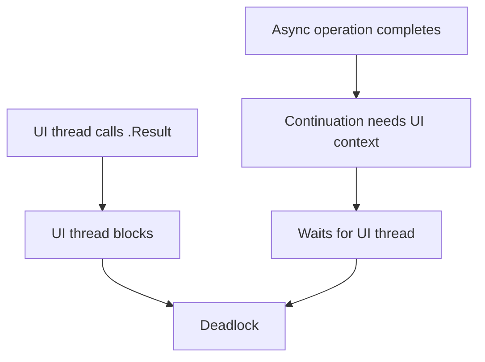

ASP.NET Core normally has no request `SynchronizationContext`, so this classic UI
deadlock is less common there. Blocking still wastes server threads.

### Why `async void` is dangerous

#### Incorrect business method

```csharp
public async void SynchronizeAsync()
{
    await _repository.SaveChangesAsync();
}
```

The caller cannot await completion, compose the operation, or observe its
exception through a returned Task.

#### Acceptable WPF event handler

```csharp
private async void SynchronizeButton_Click(
    object sender,
    RoutedEventArgs e)
{
    try
    {
        await _service.SynchronizeAsync();
    }
    catch (Exception exception)
    {
        // Log and show a UI-boundary error.
    }
}
```

Event delegate signatures require `void`. The handler awaits Task-returning
business logic and handles errors at the UI boundary.

### Exception propagation

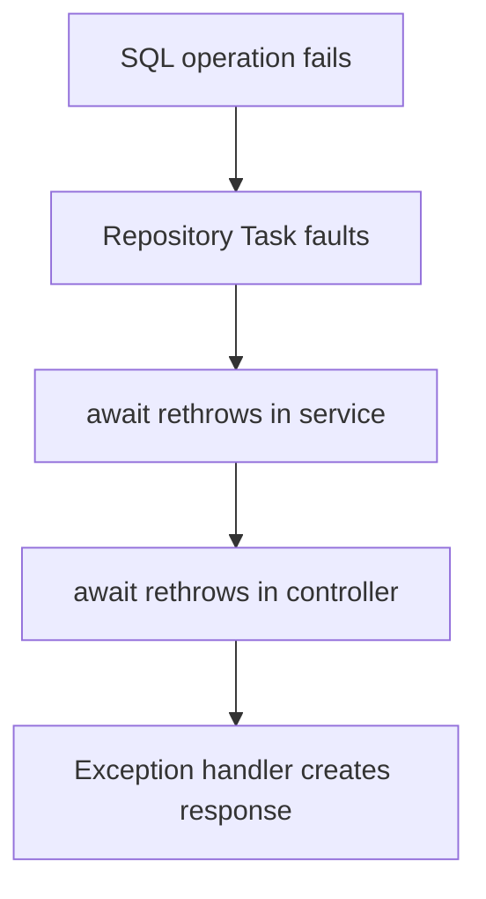

Do not add `try/catch` to every method. Catch where code can recover, retry,
translate an expected exception, add useful context, or produce the correct
boundary response.

### Ignored Task and fire-and-forget

#### Incorrect

```csharp
_deviceRepository.SaveChangesAsync(cancellationToken);
return Ok();
```

The request can finish before persistence. The caller cannot observe completion
or errors, and request-scoped services may be disposed while work continues.

Use an explicit background mechanism such as `BackgroundService`, `Channel<T>`,
or a durable message broker when work truly outlives the request.

### Sequential versus concurrent operations

#### Sequential

```csharp
var temperature = await ReadTemperatureAsync();
var humidity = await ReadHumidityAsync();
```

The humidity operation is not called until temperature completes.

#### Concurrent

```csharp
var temperatureTask = ReadTemperatureAsync();
var humidityTask = ReadHumidityAsync();

await Task.WhenAll(temperatureTask, humidityTask);
```

Both operations start before either is awaited. They may finish in any order.
`Task.WhenAll` combines existing Tasks; it does not create threads and does not
start operations by itself.

### AssetMonitoring ordering decision

Messages from one device must be processed sequentially to preserve its sequence.
Different devices may be processed concurrently.

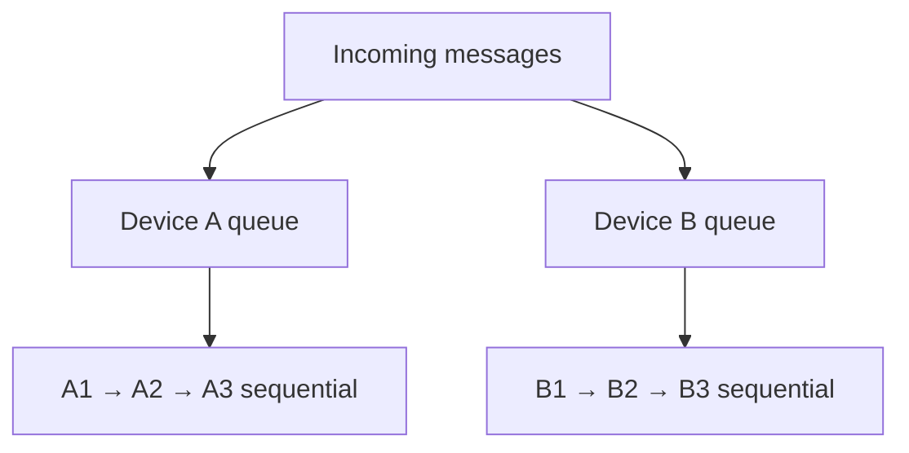

### `Task.WhenAll` exception scenario — next study checkpoint

Suppose Task A fails after one second and Task B succeeds after five seconds.
`Task.WhenAll` normally completes only after both tasks reach a final state. The
combined Task becomes faulted, and awaiting it throws after that combined
completion. One failure does not automatically cancel the other task.

With several failures, the combined Task records all exceptions. Ordinary
`await` throws one exception; inspect the completed combined Task's `Exception`
when every failure must be examined.

```csharp
var allTasks = Task.WhenAll(taskA, taskB);

try
{
    await allTasks;
}
catch
{
    var allExceptions = allTasks.Exception?.InnerExceptions;
    throw;
}
```

### Interview questions

#### Does async create another thread?

> No. It enables await-based state-machine behavior. The underlying operation
> decides whether a Thread Pool thread, OS I/O completion, or another mechanism is
> involved.

#### When does an async method begin?

> Immediately when called. It runs synchronously until it reaches an incomplete
> await.

#### What happens when the awaited Task is already complete?

> Await takes the synchronous fast path and the method continues immediately
> without yielding control.

#### What happens when await completes?

> The continuation resumes after the await. It is not guaranteed to use the same
> thread, although context rules depend on the application type.

#### Is a Task a thread?

> No. A Task represents an operation and its eventual completion. The underlying
> operation determines whether a thread is used.

#### Why avoid `.Result`?

> It blocks the current thread, harms server scalability, and can deadlock a UI
> thread when the continuation needs the captured UI context.

#### What does async all the way mean?

> Every layer returns and awaits Tasks rather than converting asynchronous work
> into blocking calls. Cancellation and exceptions can then flow through the same
> call chain.

#### When is async void acceptable?

> Normally only for event handlers whose delegate requires void. Controllers,
> services, and repositories should return Task or Task<T>.

#### Does Task.WhenAll create parallel threads?

> No. It represents the combined completion of Tasks that have already been
> created. Concurrency and thread usage depend on the underlying operations.

#### What is the difference between sequential and concurrent awaits?

> Sequential code awaits one operation before starting the next. Concurrent code
> starts independent operations first and then awaits their combined completion.

#### How do exceptions propagate from an async Task method?

> The returned Task becomes faulted. Awaiting it rethrows the failure, which can
> continue through awaited callers until an appropriate boundary handles it.

#### Does one failed Task stop the other Tasks in WhenAll?

> No, not automatically. Cancellation must be explicitly coordinated through a
> token or another mechanism.

#### Should Task.Run wrap an EF Core async query?

> No. EF Core already performs asynchronous I/O. Wrapping it wastes a Thread Pool
> thread and adds scheduling overhead.

---

## 13. Collections, equality, and LINQ

### Choosing a collection from the business rule

| Collection | Main characteristic | AssetMonitoring use |
| --- | --- | --- |
| `List<T>` | Ordered sequence; duplicates allowed | Preserve JSON input |
| `HashSet<T>` | Unique values; fast membership | Codes and domain capabilities |
| `Dictionary<TKey,TValue>` | Fast lookup by unique key | Existing devices by code |
| `IReadOnlyCollection<T>` | Read-only consumer view | API response capabilities |
| `IReadOnlySet<T>` | Read-only set semantics | Domain capabilities |

The correct collection is part of the model, not merely a performance choice.

### `List<T>` for input

```json
"capabilities": ["Temperature", "Temperature"]
```

The input DTO must preserve this duplicate so the validator can report it.

### `HashSet<T>` for uniqueness

```csharp
var capabilities = new HashSet<DeviceCapability>();

if (!capabilities.Add(capability))
{
    // Duplicate.
}
```

Average insertion and membership lookup are O(1). Processing `n` values is
therefore O(n) on average.

### `Dictionary<TKey,TValue>` for reconciliation

```csharp
var existingByCode = existingDevices.ToDictionary(
    device => device.Code,
    StringComparer.OrdinalIgnoreCase);

if (existingByCode.TryGetValue(item.Code, out var existing))
{
    // Existing device found without a list scan.
}
```

`TryGetValue` performs one lookup and avoids an exception for an expected missing
key.

### Set equality versus sequence equality

```csharp
_capabilities.SetEquals(newCapabilities)
```

Set equality ignores order:

```text
[Temperature, Humidity] == [Humidity, Temperature]
```

`SequenceEqual` would treat different ordering as a change, which is wrong when
capability order has no business meaning.

### Tuple equality

```csharp
var current =
    (Name, HardwareModel, HardwareRevision, FirmwareVersion, Location);

var incoming =
    (name, hardwareModel, hardwareRevision, firmwareVersion, location);

var metadataIsEqual = current == incoming;
```

Value tuples compare their elements in order. This makes the “all scalar metadata
is equal” check concise. It does not replace explicit property assignment.

### Materialize an enumerable once

#### Risky repeated enumeration

```csharp
var equal = _capabilities.SetEquals(capabilities);
ApplyMetadata(capabilities.ToHashSet());
```

An arbitrary `IEnumerable<T>` may be expensive, stateful, or one-use.

#### Better

```csharp
var newCapabilities = capabilities.ToHashSet();
var equal = _capabilities.SetEquals(newCapabilities);

ApplyMetadata(newCapabilities);
```

### `IEnumerable<T>` versus `IQueryable<T>`

```csharp
IQueryable<Device> query = _dbContext.Devices.AsNoTracking();
query = query.Where(device => device.Lifecycle == lifecycle);
```

Before materialization, EF builds an expression tree that can become SQL.

```csharp
var devices = await query.ToListAsync(cancellationToken);
```

After `ToListAsync`, the results are in memory and normal LINQ-to-Objects applies.

#### Incorrect early materialization

```csharp
var devices = await _dbContext.Devices.ToListAsync();
var active = devices.Where(device => device.Lifecycle == lifecycle);
```

This loads every row and filters in memory. For large tables, apply supported
filters before materialization.

### Interview questions

#### When should you choose HashSet instead of List?

> Choose HashSet when uniqueness and membership are central and order is not.
> Choose List when order and faithful sequence representation matter or duplicates
> must be preserved.

#### Why use SetEquals for capabilities?

> Capability order has no business meaning. SetEquals compares membership and
> uniqueness rather than sequence position.

#### Why use TryGetValue?

> It combines lookup and existence checking without throwing for an expected
> missing key and avoids a second dictionary lookup.

#### What is the difference between IQueryable and IEnumerable?

> `IQueryable` carries an expression that a provider such as EF Core can translate
> to SQL. `IEnumerable` enumerates .NET objects, normally in memory.

---

## 14. Exceptions, validation, and HTTP errors

### Three failure categories

| Category | Example | Normal representation |
| --- | --- | --- |
| Programmer/contract error | Null required constructor dependency | Exception |
| Technical failure | Missing file, malformed JSON, SQL unavailable | Exception handled at boundary |
| Expected business invalidity | Duplicate code, empty capability list | Structured validation result |

### Domain guard clauses

```csharp
ArgumentNullException.ThrowIfNull(capabilities);

if (string.IsNullOrWhiteSpace(code))
{
    throw new ArgumentException(
        "Device code is required.",
        nameof(code));
}
```

The entity refuses impossible construction. This is different from catalog
validation, which accumulates errors for an external document.

### Do not throw and immediately catch without purpose

#### Incorrect

```csharp
try
{
    throw new ArgumentException("Invalid catalog.");
}
catch (ArgumentException)
{
    return BadRequest();
}
```

For expected catalog errors, return a validation result. For technical exceptions,
let centralized middleware translate unexpected failures unless the current layer
can recover or add meaningful context.

### ProblemDetails

```json
{
  "title": "Device not found.",
  "status": 404,
  "detail": "A device with code 'WH-051' was not found.",
  "instance": "/api/devices/WH-051",
  "traceId": "..."
}
```

`ProblemDetails` gives clients a predictable HTTP error shape.

### Validation response

```json
{
  "isValid": false,
  "errors": [
    {
      "errorCode": "DuplicateDeviceCode",
      "message": "Device contains duplicate code 'WH-001'.",
      "deviceCode": "WH-001",
      "propertyName": "Code"
    }
  ]
}
```

Error codes are stable for machines; messages are readable for humans.

### Logging does not belong inside the entity

#### Incorrect direction

```csharp
public bool Retire(DateTime retiredAtUtc)
{
    Lifecycle = DeviceLifecycle.Retired;
    Console.WriteLine("Device retired");
    return true;
}
```

The domain entity now depends on an output mechanism.

#### Better boundary

```csharp
if (device.Retire(now))
{
    logger.LogInformation(
        "Device {DeviceCode} was retired at {RetiredAtUtc}",
        device.Code,
        now);
}
```

The application layer knows the use-case context and can produce structured logs
or domain events.

### XML documentation

Public APIs in the project are documented with XML comments:

```csharp
/// <summary>
/// Returns all devices, optionally filtered by lifecycle.
/// </summary>
/// <param name="lifecycle">
/// Optional lifecycle filter; null returns every lifecycle.
/// </param>
/// <param name="cancellationToken">
/// Token used to cancel the asynchronous query.
/// </param>
/// <returns>A read-only collection of device responses.</returns>
Task<IReadOnlyList<DeviceResponse>> GetAllAsync(
    DeviceLifecycle? lifecycle = null,
    CancellationToken cancellationToken = default);
```

The project can generate documentation and treat missing public XML comments as
build errors:

```xml
<PropertyGroup>
  <GenerateDocumentationFile>true</GenerateDocumentationFile>
  <WarningsAsErrors>$(WarningsAsErrors);CS1591</WarningsAsErrors>
</PropertyGroup>
```

Do not suppress `CS1591` if the explicit project rule is that every public type
and member must have XML documentation. CI should enforce the same build settings
as local development.

### Interview questions

#### When should validation return errors rather than throw?

> When invalidity is an expected outcome that the caller can correct, such as a
> catalog with duplicate codes. Exceptions are appropriate for broken contracts
> or technical failures such as malformed JSON or unavailable SQL.

#### Where should exceptions be caught?

> Catch where the application can recover, retry, translate an expected failure,
> add useful context, or produce a boundary response. Otherwise allow centralized
> handling to observe it.

#### Why use error codes and messages?

> Codes provide stable machine-readable categories, while messages explain the
> particular failure to a human.

#### Why not log from the Device entity?

> Logging is an infrastructure concern. The entity should express state changes;
> the application boundary can log them with request and use-case context.

---

# Part III — Designed next stages

## 15. Telemetry model

### Why telemetry is not stored on Device

`Device` describes identity, metadata, supported capabilities, and lifecycle.
Telemetry represents time-series observations and can grow without limit.

```mermaid
flowchart TB
    Device["Device metadata"] --> Capability["Supported capabilities"]
    Device --> Measurements["Many telemetry measurements"]
    Measurements --> Current["Current state projection"]
    Measurements --> History["Historical analysis"]
```

Putting current temperature, humidity, door, and light values directly on the
catalog entity would mix two responsibilities and complicate history.

### Numeric and state measurements

The design separates two value families.

```csharp
public sealed class NumericTelemetryMeasurement
{
    public Guid Id { get; init; }
    public Guid DeviceId { get; init; }
    public NumericMeasurementType Type { get; init; }
    public double Value { get; init; }
    public string Unit { get; init; } = null!;
    public DateTime MeasuredAtUtc { get; init; }
}
```

```csharp
public sealed class StateTelemetryMeasurement
{
    public Guid Id { get; init; }
    public Guid DeviceId { get; init; }
    public StateMeasurementType Type { get; init; }
    public DeviceStateValue Value { get; init; }
    public DateTime MeasuredAtUtc { get; init; }
}
```

Temperature and humidity are numeric. Door and light are discrete states.

### Why not `object Value`?

#### Incorrect

```csharp
public object Value { get; init; }
```

Every consumer must inspect and cast the runtime value. Invalid combinations are
easy to create, such as a string temperature or numeric door state.

Separate types make legal states explicit and simplify rule evaluation.

### Controller byte versus domain enum

Embedded devices often send `0` and `1` bytes. The transport boundary can map
them to domain states:

```text
Door byte 0 → Closed
Door byte 1 → Open
Light byte 0 → Off
Light byte 1 → On
```

Internally, enums are clearer than scattering numeric comparisons throughout
business logic.

### Measurement identity

Each measurement has its own `Guid`. The message envelope also has a `MessageId`.
They solve different problems:

| Identifier | Purpose |
| --- | --- |
| `MessageId` | Deduplicate a received transport message |
| Measurement `Id` | Identify one persisted measurement |
| `DeviceId` | Link the measurement to its Device |

One message can eventually contain several measurements.

### Device and server time

For delayed telemetry, preserve when the controller measured the value and also
record when the server accepted it:

```text
MeasuredAtUtc → device/controller event time
ReceivedAtUtc → server ingestion time
```

Using only receipt time would rewrite delayed history. Trust boundaries still
require validation of obviously impossible device timestamps.

### Capability check

A device may report only a supported measurement type:

```text
WH-007 capabilities: LightState
Incoming Temperature → reject as unsupported
Incoming LightState  → accept
```

### Physically invalid values

Humidity outside 0–100% is invalid input, not immediately proof of a real
warehouse incident. The design records a rejection/quality event and requires
repeated bad samples before declaring a persistent sensor problem.

One abnormal sample must not automatically become accepted truth.

### Interview questions

#### Why separate numeric and state telemetry?

> They have different value types, units, validation, aggregation, and alert
> operations. Separate models prevent runtime casting and invalid combinations.

#### Why keep both MeasuredAtUtc and ReceivedAtUtc?

> The first preserves event time from the device; the second records ingestion
> time at the trusted server. Their difference reveals network delay.

#### Why does MessageId not replace measurement Id?

> MessageId identifies the transport envelope for deduplication. A message may
> contain several independent measurements, each needing its own stored identity.

---

## 16. Heartbeat, ordering, and idempotency

### Connectivity states

```mermaid
stateDiagram-v2
    [*] --> NeverConnected
    NeverConnected --> Online: first valid heartbeat
    Online --> Online: later heartbeat
    Online --> Offline: timeout exceeded
    Offline --> Online: new valid heartbeat
```

`NeverConnected` and `Offline` are different:

- NeverConnected means no successful heartbeat has ever arrived.
- Offline means the device was previously connected but its heartbeat became
  stale.

### Activation decision

The planned business rule is:

> A Registered device becomes active for monitoring only after its first valid
> heartbeat.

Telemetry received before activation may be accepted and stored for diagnostics,
but it must not create normal threshold alerts. After activation, alert
evaluation begins with new telemetry rather than retroactively treating earlier
untrusted values as active operational state.

### Heartbeat missing alert

If no heartbeat arrives for the configured timeout, create a separate
`HeartbeatMissing` alert. Connectivity failure is not the same category as a
temperature threshold violation.

### Message envelope

```csharp
public sealed record TelemetryMessage(
    Guid MessageId,
    Guid DeviceId,
    Guid SessionId,
    long SequenceNumber,
    DateTime SentAtUtc,
    IReadOnlyList<TelemetryMeasurement> Measurements);
```

### Session and sequence number

After a controller reboot, it creates a new `SessionId` and restarts its sequence
number.

```text
Session A: 1, 2, 3, 4
reboot
Session B: 1, 2, 3
```

Without a session identifier, the server might reject valid post-reboot message
`1` as older than pre-reboot message `4`.

### Ordering rule

```text
Same Device + same Session → process by SequenceNumber
Different Devices         → may process concurrently
```

This preserves per-device correctness without forcing the entire platform into
one global queue.

### Message deduplication

`MessageId` needs a unique SQL constraint. In-memory deduplication is lost on
restart and does not coordinate several application instances.

```text
Receive MessageId
      ↓
Already stored? ── yes → return idempotent duplicate result
      │ no
      ↓
Validate and persist atomically
```

### Rejection history

The planned design uses one rejection table with a reason enum rather than one
table per reason. Examples:

- duplicate message;
- unknown device;
- unsupported capability;
- invalid value;
- stale session;
- out-of-order sequence;
- inactive device policy.

One table makes operational inspection and querying simpler while the reason
field preserves meaning.

### In-memory scheduling state versus durable identity

Short-lived scheduling state can live in application memory, but durable
deduplication identity must live in SQL.

```text
In memory: active per-device processing queues
SQL:       MessageId uniqueness and accepted/rejected history
```

### Interview questions

#### Why distinguish NeverConnected and Offline?

> Offline implies a previous connection and a missed expected heartbeat.
> NeverConnected means the system has no connectivity evidence yet, which is a
> different operational condition.

#### Why use both SessionId and SequenceNumber?

> SequenceNumber orders messages inside one boot session. SessionId allows the
> sequence to restart after reboot without confusing new messages with stale old
> ones.

#### Why persist MessageId in SQL?

> SQL survives restarts and provides a shared uniqueness boundary for several
> application instances. An in-memory set cannot guarantee that.

#### Why process one device sequentially but devices concurrently?

> Ordering matters within one device stream. Independent devices do not share
> that sequence and can be processed concurrently for throughput.

---

## 17. Alerts and notifications

### Alert versus AlertRule

| Object | Responsibility |
| --- | --- |
| `AlertRule` | Describes what condition should be checked |
| `Alert` | Records a detected violation for a device |
| `Notification` | Records an attempt to deliver an alert to an Admin |

An Alert is the result, not the rule itself.

### Planned rule families

```mermaid
classDiagram
    class AlertRule {
        <<abstract>>
        Id
        Severity
        Evaluate()
    }
    class ThresholdAlertRule {
        MeasurementType
        Operator
        Threshold
    }
    class StateAlertRule {
        StateType
        ExpectedState
        TimeWindow
    }
    AlertRule <|-- ThresholdAlertRule
    AlertRule <|-- StateAlertRule
```

Numeric thresholds and state/time rules are independent variations:

- temperature exceeds a limit;
- humidity is outside an allowed range;
- door remains open after 21:00;
- light remains on after 21:00.

Connectivity uses a separate `HeartbeatMissing` alert category because its source
is device availability, not a telemetry threshold.

### Why not one large enum-driven method?

#### Incorrect

```csharp
public void Evaluate(AlertRuleType type, object value)
{
    if (type == AlertRuleType.Temperature) { ... }
    else if (type == AlertRuleType.Door) { ... }
    else if (type == AlertRuleType.Light) { ... }
    else if (type == AlertRuleType.Heartbeat) { ... }
}
```

This mixes numeric comparison, state comparison, time windows, connectivity, and
runtime casting.

Separate rule implementations preserve clear contracts while a common result
type allows the service to collect alerts.

### Consecutive evidence

The design does not treat one suspicious sensor value as truth. A rule can
require more than three consecutive violating measurements before opening an
alert.

```mermaid
stateDiagram-v2
    [*] --> Normal
    Normal --> Suspected: first violation
    Suspected --> Suspected: next violation
    Suspected --> Normal: valid measurement
    Suspected --> AlertOpen: confirmation count exceeded
    AlertOpen --> Resolved: recovery condition met
```

The exact threshold is configuration. The important concept is that transient
noise and persistent abnormal state are different.

### Multiple simultaneous alerts

One telemetry message may violate several independent rules. Evaluate all
applicable rules, collect all resulting alerts, persist them, and then publish
notification work.

```text
Temperature high ─┐
Door open late ───┼→ persist alerts → notification event
Light on late ────┘
```

Returning after the first violation would hide other problems observed in the
same device state.

### Severity and category

Severity answers “how serious?”; category answers “what kind of problem?”

```text
Severity: Warning, Critical
Category: ThresholdViolation, StateViolation, HeartbeatMissing
```

Do not overload severity with `DeviceOffline`; offline is a category or alert
type, not a level between Warning and Critical.

### Alert and notification flow

```mermaid
flowchart TB
    Telemetry["Accepted telemetry"] --> Rules["Evaluate applicable rules"]
    Heartbeat["Connectivity monitor"] --> Rules
    Rules --> Alerts["Persist alerts"]
    Alerts --> Event["Publish notification event"]
    Event --> Send["Send to Admin"]
    Send --> History["Store delivery outcome"]
```

### Delivery failure

If notification sending fails, the alert must remain stored. A later delivery
attempt can retry after a configured delay such as one minute.

The design also limits repeated reminders for the same still-open incident, for
example no more than one reminder per hour. A stable notification/event ID and
SQL state make retry idempotent.

### Why persistence before notification?

If the process crashes after storing the alert but before delivery, notification
can be retried. If it sends first and crashes before saving, delivery can be lost
or duplicated without a reliable record.

The future robust solution is an outbox-style transaction:

```text
SQL transaction
├── insert Alert
└── insert OutboxMessage

Background publisher → broker → notification handler
```

### Interview questions

#### What is the difference between AlertRule and Alert?

> The rule defines a condition. An Alert is a persisted occurrence produced when
> device data violates that condition.

#### Why separate threshold and state rules?

> Numeric comparisons and state/time-window checks have different inputs and
> behavior. Separate rule types avoid object casting and large conditional logic.

#### Why require consecutive violations?

> A single sample may be noise, delay, or sensor error. Consecutive evidence helps
> distinguish a persistent condition from a transient anomaly.

#### What happens when notification delivery fails?

> The Alert remains persisted. Delivery history records the failed attempt and a
> controlled retry can occur later without recreating the Alert.

---

## 18. RabbitMQ, MediatR, and Polly

These technologies solve different problems and are planned only when the
corresponding need appears.

| Technology | Scope | Purpose |
| --- | --- | --- |
| MediatR | In-process | Dispatch commands, queries, or notifications inside one process |
| RabbitMQ | Cross-process broker | Durable asynchronous communication between producers and consumers |
| Polly | Resilience policies | Retry, timeout, circuit breaker, fallback |

### MediatR is not a message broker

```text
Same ASP.NET Core process
Controller → MediatR → Handler
```

If the process crashes, an in-memory MediatR notification is not a durable queued
message. It is useful for decoupling in-process handlers, but it does not replace
RabbitMQ.

### RabbitMQ

```mermaid
flowchart LR
    Alerting["Alerting module"] --> Outbox[("Outbox")]
    Outbox --> Rabbit["RabbitMQ"]
    Rabbit --> Notification["Notification worker"]
    Notification --> Admin["Admin channel"]
```

RabbitMQ becomes useful when delivery should be asynchronous, durable, scalable,
or handled by another process.

### Polly

Polly can express controlled resilience:

```text
attempt send
   ↓ failure
wait one minute
   ↓
retry according to policy
```

Retry only transient failures. Retrying invalid credentials or malformed
requests merely repeats a permanent error.

### Why not add all three immediately?

Every abstraction and dependency has a cost. The first vertical slice needs none
of them. Add them when notification delivery, process separation, or transient
network failures become implemented requirements.

### Interview questions

#### Can MediatR replace RabbitMQ?

> No. MediatR dispatches inside one process. RabbitMQ is an external broker that
> supports durable asynchronous communication across processes.

#### What problem does Polly solve?

> It applies explicit resilience strategies such as retry, timeout, and circuit
> breaker around operations that can experience transient failures.

#### Should every exception be retried?

> No. Retry only failures likely to become successful later. Validation and other
> permanent failures should fail immediately.

---

## 19. Device simulator and realtime dashboard

### Simulator responsibility

The simulator represents ten independent warehouse controllers. It creates
realistic messages and controlled failures; the API remains responsible for
validation and business decisions.

```mermaid
flowchart TB
    Controls["Start / Pause / Stop"] --> Simulator["Device Simulator"]
    Simulator --> Devices["10 device loops"]
    Devices --> API["AssetMonitoring API"]
    API --> SignalR["SignalR updates"]
    SignalR --> UI["React warehouse dashboard"]
```

### Concurrency model

Each simulated device can have its own asynchronous loop and interval. Different
telemetry types may be emitted every 20 minutes or hourly in simulated time.

Avoid uncontrolled nested infinite loops. A cancellation token and explicit
simulation state must support Start, Pause, and Stop.

### Deterministic scenarios

Random values alone make demonstrations and tests unreliable. A random seed and
named scenarios allow the same behavior to be reproduced:

- normal operation;
- high temperature;
- invalid humidity;
- door left open after 21:00;
- light left on after 21:00;
- missing heartbeat;
- duplicate message;
- out-of-order sequence;
- delayed delivery;
- temporary notification/network failure.

### Dashboard responsibility

The planned React/TypeScript UI visualizes backend state. It must not invent
telemetry locally.

Planned areas:

- top summary of online/offline devices and active alerts;
- SVG warehouse with ten devices;
- temperature, humidity, door, and light indicators;
- alert and notification history;
- simulation controls.

Animations are state-driven:

| State | Visual behavior |
| --- | --- |
| New measurement | Sensor pulse |
| Door open/closed | Door movement |
| Light on | Glow |
| Offline | Grey device |
| Warning | Yellow highlight |
| Critical | Red highlight |

### Interview questions

#### Why should the browser not generate fake telemetry?

> The backend must remain the source of truth and execute the same validation,
> ordering, persistence, and alert rules used by real devices. The browser should
> only visualize accepted state.

#### Why use deterministic scenarios?

> They make bugs, demos, and automated tests reproducible. Pure randomness can
> hide failures or make them impossible to repeat.

---

## 20. Testing and CI

### Testing agreement

The project intentionally finishes each backend vertical slice and manually
verifies it before adding the full automated test suite. Tests are not abandoned;
they are the next protection after behavior and boundaries stabilize.

### Planned test pyramid

| Test type | Examples |
| --- | --- |
| Domain unit tests | Retire, Restore, UpdateMetadata, UTC guards |
| Validator unit tests | Count, required fields, duplicate code/capability |
| Application unit tests | Created/updated/unchanged/retired/restored counters |
| Persistence integration tests | EF mapping, unique code, capability storage |
| API integration tests | 200, 400 validation, 404 ProblemDetails |

### Important test examples

```text
Retire called twice
→ first returns true
→ second returns false
→ timestamp remains consistent
```

```text
Synchronize same catalog twice
→ first creates 10
→ second reports unchanged 10
→ database still contains 10 active catalog rows
```

```text
Catalog contains WH-001 and wh-001
→ validation returns DuplicateDeviceCode
→ SQL is not modified
```

### CI workflow

```yaml
name: CI

on:
  pull_request:
    branches:
      - master
  push:
    branches:
      - master

permissions:
  contents: read

concurrency:
  group: ci-${{ github.workflow }}-${{ github.ref }}
  cancel-in-progress: true

jobs:
  build:
    name: ci-build
    runs-on: ubuntu-latest
    timeout-minutes: 10

    steps:
      - name: Checkout repository
        uses: actions/checkout@v7

      - name: Setup .NET
        uses: actions/setup-dotnet@v6
        with:
          dotnet-version: "10.0.x"

      - name: Restore dependencies
        run: dotnet restore AssetMonitoring.slnx

      - name: Build solution
        run: >-
          dotnet build AssetMonitoring.slnx
          --configuration Release
          --no-restore
```

### Branch protection

The workflow alone does not forbid merging. GitHub branch protection or a ruleset
must require the `ci-build` status check before merge.

```mermaid
flowchart LR
    Push["Push feature branch"] --> PR["Open PR"]
    PR --> CI["Restore and Release build"]
    CI --> Pass{"Check passes?"}
    Pass -- No --> Fix["Fix and push"]
    Fix --> CI
    Pass -- Yes --> Merge["Merge enabled"]
```

When tests are added, CI should run `dotnet test` after the build.

### Interview questions

#### What is the difference between CI and branch protection?

> CI runs automated checks. Branch protection makes their successful result a
> required condition for merge.

#### Why run Release build in CI?

> It verifies the configuration intended for deployment and can expose issues not
> visible in a Debug-only local build.

#### Why add integration tests for EF mappings?

> Domain unit tests cannot prove that private fields, enum conversion, SQL
> nullability, unique indexes, and provider-specific collections are mapped
> correctly.

---

## 21. Project status and next steps

### Completed and verified

| Area | Status | Evidence |
| --- | :---: | --- |
| .NET 10 modular solution | ✅ | API plus four module projects build |
| Device domain entity | ✅ | Metadata, capabilities, UTC, lifecycle |
| Retire/Restore | ✅ | Idempotent boolean transitions |
| UpdateMetadata | ✅ | Tuple and set comparison |
| Catalog contracts | ✅ | Document and item DTOs |
| JSON reader | ✅ | Async deserialization and enum strings |
| Catalog validation | ✅ | Count, required fields, duplicate codes/capabilities |
| Catalog loader | ✅ | Reader plus validator orchestration |
| Ten-device JSON catalog | ✅ | Valid warehouse catalog |
| Synchronization algorithm | ✅ | Create/update/unchanged/retire/restore |
| EF Core mapping/migration | ✅ | SQL table and unique code index |
| SQL database update | ✅ | Devices inspected in SQL tooling |
| Repository | ✅ | Tracked load, add, one save |
| DI registration | ✅ | Module registration and lifetimes |
| Synchronization API | ✅ | POST tested with idempotent results |
| Device query API | ✅ | GET all/filter and GET by code |
| HTTP errors | ✅ | 404 ProblemDetails verified |
| CI build | ✅ | Restore and Release build on PR/push |
| README and PR workflow | ✅ | Merged into repository |

### Planned backend work

1. Complete automated tests for the Device Management vertical slice.
2. Add explicit device activation.
3. Implement heartbeat sessions and connectivity projection.
4. Implement message ingestion and deduplication.
5. Implement numeric and state telemetry persistence.
6. Implement rule evaluation and alert lifecycle.
7. Implement notification delivery and retry history.
8. Add simulator, SignalR, and dashboard.
9. Add authentication, authorization, observability, Docker, and production
   configuration later.

### Planned learning topics

| Topic | Status |
| --- | --- |
| SOLID | ✅ Complete |
| DI fundamentals | ✅ Complete |
| DI lifetimes | ✅ Complete |
| IDisposable/IAsyncDisposable | ✅ Complete |
| Async fundamentals | ✅ Complete |
| Task.WhenAll exceptions | 🚧 Current checkpoint |
| CancellationToken | 📋 Next |
| EF tracking and Unit of Work | 🚧 Applied; deeper review planned |
| Testing | 📋 After backend slice |
| Messaging and resilience | 📋 When notification slice begins |

---

## 22. Rapid interview review

### Project elevator pitch

> AssetMonitoring is a .NET 10 modular-monolith IoT backend. The first completed
> vertical slice reads a ten-device warehouse catalog from JSON, validates it,
> reconciles it idempotently with SQL Server through EF Core, and exposes devices
> through ASP.NET Core APIs. The design separates domain behavior, application use
> cases, query models, and infrastructure. Next slices add heartbeat ordering,
> telemetry, alerting, reliable notifications, and a realtime simulator dashboard.

### Fast questions and answers

| Question | Short answer |
| --- | --- |
| Why modular monolith? | Clear boundaries without premature distributed operations |
| Why is Device a class? | Entity identity and mutable lifecycle |
| Why private setters? | Protect domain invariants |
| Why nullable RetiredAtUtc? | Non-retired devices have no retirement time |
| Why HashSet capabilities? | Unique unordered business values |
| Why List in catalog DTO? | Preserve JSON order and duplicates for validation |
| Why structured validation? | Report every expected business input problem |
| Why Dictionary in sync? | Average O(1) lookup by code |
| Why retire instead of delete? | Preserve identity and telemetry history |
| Why one SaveChangesAsync? | One unit of work and fewer round trips |
| Is synchronization idempotent? | Yes for repeated equal input; concurrency still needs DB protection |
| Why unique SQL Code? | Final integrity boundary under concurrent writes |
| Why AsNoTracking for GET? | No change tracking is needed for read-only results |
| Why response DTO? | Do not expose tracked domain entities as API contracts |
| Why POST synchronize? | It changes server state |
| What is SRP? | One responsibility and reason to change |
| What is OCP? | Add variations through extension points |
| What is LSP? | Implementations preserve the abstraction's contract |
| What is ISP? | Clients depend only on needed operations |
| What is DIP? | Policy depends on abstractions, not infrastructure details |
| What is DI? | Dependencies are supplied from outside |
| What is Transient? | New instance per resolution |
| What is Scoped? | One instance per scope/request |
| What is Singleton? | One shared instance for root-container lifetime |
| Why Scoped DbContext? | Non-thread-safe short unit of work |
| What is captive dependency? | Longer-lived consumer retains shorter-lived service |
| What does IDisposable do? | Deterministically releases owned resources |
| Does using catch? | No; it guarantees cleanup and propagates errors |
| Does async create a thread? | No |
| Why avoid async void? | Caller cannot await completion or observe Task errors |
| Why avoid Result/Wait? | Blocking, starvation, and possible UI deadlock |
| Does WhenAll start Tasks? | No; it combines already created Tasks |
| Why numeric/state telemetry types? | Strong typing and different rule operations |
| Why SessionId plus SequenceNumber? | Correct ordering across controller reboots |
| Why persist MessageId? | Durable cross-instance deduplication |
| MediatR vs RabbitMQ? | In-process dispatch versus external durable broker |
| What does Polly add? | Explicit retry, timeout, and circuit-breaker policies |

### Answering strategy

For any theory question, use this four-part pattern:

```text
1. Definition
2. AssetMonitoring example
3. Reason and trade-off
4. Failure prevented
```

Example:

> Scoped creates one instance per DI scope, normally per ASP.NET Core request. In
> AssetMonitoring, `DbContext`, the repository, and the synchronization service
> are Scoped, so one request shares one EF Core unit of work. This prevents
> unrelated requests from sharing a non-thread-safe change tracker. Scoped does
> not itself prevent database races, so the unique Code index remains necessary.

---

# Part IV — Debugging history

## 23. Implementation mistakes and lessons

This section records mistakes discovered during implementation. These are useful
interview examples because they show how the problem was diagnosed and what rule
was learned.

### Summary table

| Symptom or mistake | Root cause | Lesson |
| --- | --- | --- |
| Module names appeared twice in Solution Explorer | Folders were created inside one root project and separate projects were also added | A folder is not a `.csproj`; keep one project per module under `src` |
| Namespace expected `AssetMonitoring.src...` | Project/folder structure and root namespace were mixed | Namespace represents code boundary, not repository folder `src` |
| Public strings produced nullable warnings | EF-only constructor could leave properties uninitialized | Use validated public construction plus EF constructor and justified `null!` initialization |
| Constructor rejected non-null capabilities | Guard used `capabilities != null` | Carefully express negative guard: invalid when `capabilities is null` |
| `RegisteredAtUtc = null` did not compile | `DateTime` is non-nullable and the wrong property was assigned | Only `RetiredAtUtc` is nullable |
| Updating readonly HashSet attempted field reassignment | `readonly` permits mutation of the object, not reassignment of the field | Use `Clear` plus `UnionWith`, or replace only when the field is not readonly |
| Duplicate code validation never failed | HashSet was created inside the device loop | Accumulator collections belong outside the loop |
| Validator returned `DeviceCatalogValidationResult(document)` | Constructor expects errors, not catalog document | Keep result types aligned with their responsibility |
| Loader was created with `new DeviceCatalogLoader()` in controller | Required dependencies were missing and DI was bypassed | Inject the loader or synchronization service through the controller constructor |
| Hard-coded `D:\\...` catalog path | Machine-specific absolute path | Build the path from `ContentRootPath` and `Path.Combine` |
| Synchronize received only `ContentRootPath` | Service expected a file path | Construct and pass the complete `device-catalog.json` path |
| Action returned `ActionResult<DeviceCatalogSynchronizationService>` | Response type named the service instead of its result | Return `ActionResult<DeviceCatalogSynchronizationResult>` |
| API returned a Task serialization exception | Query Task was passed to `Ok` without `await` | Await asynchronous results before serialization |
| EF said `RegisteredAtUtc` could not be optional | Configuration mapped the same non-nullable property twice | Map `RegisteredAtUtc` required and `RetiredAtUtc` optional |
| EF rejected `HashSet<DeviceCapability>` primitive collection | Provider requires an array/list-like primitive collection | Match the persistence CLR type or use a converter/table |
| EF mapping declared HashSet but field was List | Fluent configuration type did not match the CLR field | Mapping metadata and CLR member type must agree exactly |
| EF tool said startup project lacked Design package | Tool executes startup configuration at design time | Add compatible design tooling to the startup project |
| OpenAPI generated code failed on read-only property | Incompatible package versions were restored together | Align framework and OpenAPI package versions; avoid unnecessary direct package pins |
| Enum API response showed `0`, `1`, `2` | Response serializer had no string enum converter | Configure `JsonStringEnumConverter` for the API boundary |
| Retired row seemed “missing” after catalog restoration test | Query/view showed only current ten catalog rows | Query all rows and inspect `Lifecycle`/`RetiredAtUtc`; retirement preserves history |

### Guard condition mistake

#### Incorrect

```csharp
if (string.IsNullOrWhiteSpace(code) || capabilities != null)
{
    throw new ArgumentException();
}
```

This rejects every valid non-null capability collection.

#### Correct

```csharp
if (string.IsNullOrWhiteSpace(code) || capabilities is null)
{
    throw new ArgumentException(
        "Required device data is missing or invalid.");
}
```

Read guard expressions aloud: “throw if code is empty **or capabilities is
null**.” This simple technique catches reversed boolean conditions.

### Readonly collection mistake

#### Incorrect

```csharp
private readonly HashSet<DeviceCapability> _capabilities;

_capabilities.Clear();
_capabilities = capabilities.ToHashSet();
```

The second line attempts to assign a new object to a readonly field.

#### Correct

```csharp
_capabilities.Clear();
_capabilities.UnionWith(capabilities);
```

`readonly` protects the field reference after construction. It does not make the
referenced collection immutable.

### Wrong action result type

#### Incorrect

```csharp
public async Task<ActionResult<DeviceCatalogSynchronizationService>>
    Synchronize(...)
```

#### Correct

```csharp
public async Task<ActionResult<DeviceCatalogSynchronizationResult>>
    Synchronize(...)
```

The generic argument describes the HTTP response body, not the component that
produces it.

### Database verification lesson

After catalog changes, the SQL table contained eleven total rows: ten current
catalog devices plus one retired historical device. This was correct.

```sql
SELECT
    Code,
    Name,
    FirmwareVersion,
    Lifecycle,
    RetiredAtUtc
FROM device_management.Devices
ORDER BY Code;
```

The important verification was not merely row count. It was the expected state:

```text
10 catalog devices → Registered and RetiredAtUtc NULL
1 removed device   → Retired and RetiredAtUtc populated
```

Restoring that code should reuse the same row and identity, not create a twelfth
row.

### Interview question: How do you approach an implementation failure?

> First, read the exact exception and identify the layer that produced it. Then
> compare the CLR contract, framework configuration, and expected data shape. Fix
> the smallest incorrect assumption, rebuild, rerun the same scenario, and verify
> both the API result and persistent SQL state.

---

## Final learning checkpoint

The next theory exercise is `Task.WhenAll` with multiple failures and
cancellation. The next implementation slice is automated testing or explicit
device activation, according to the project roadmap.
